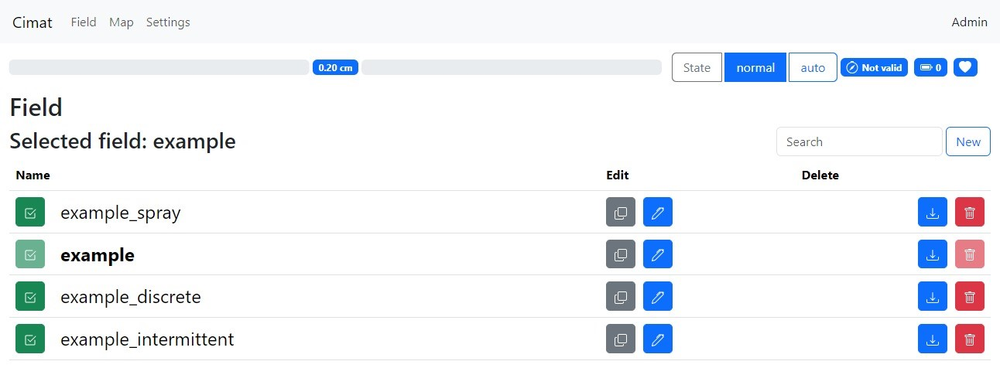
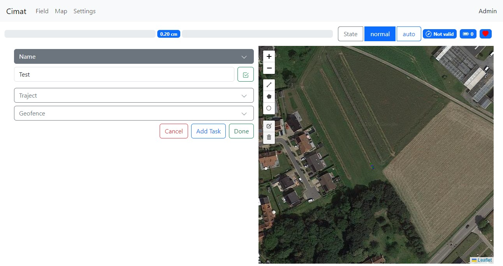
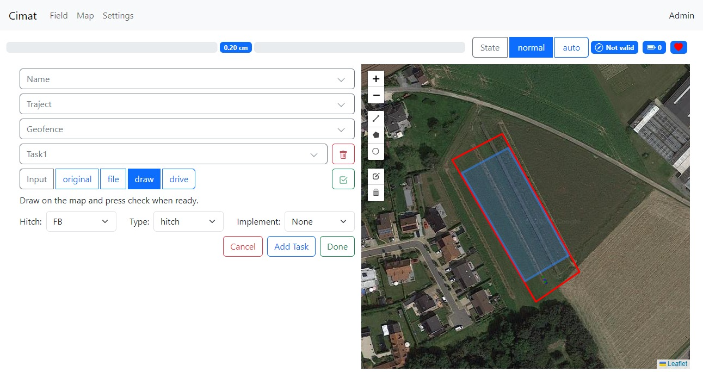
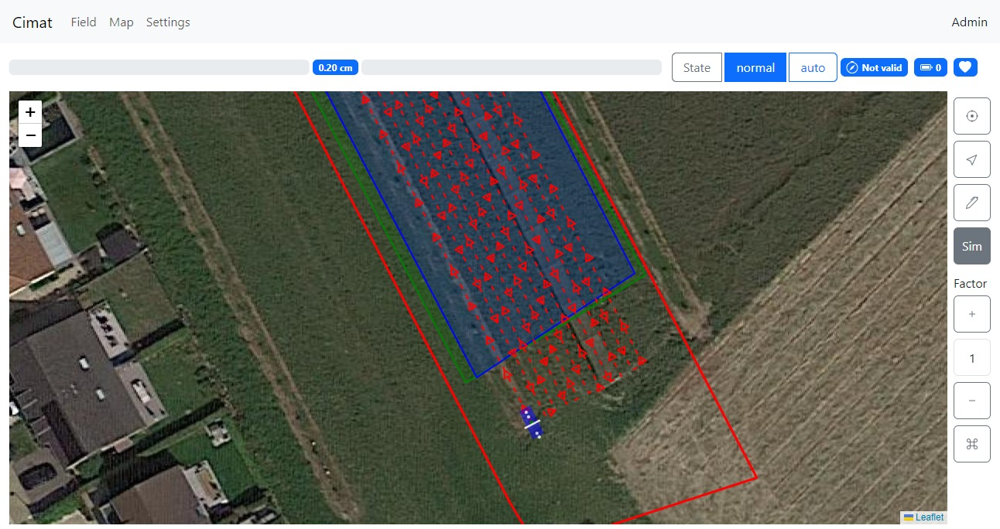
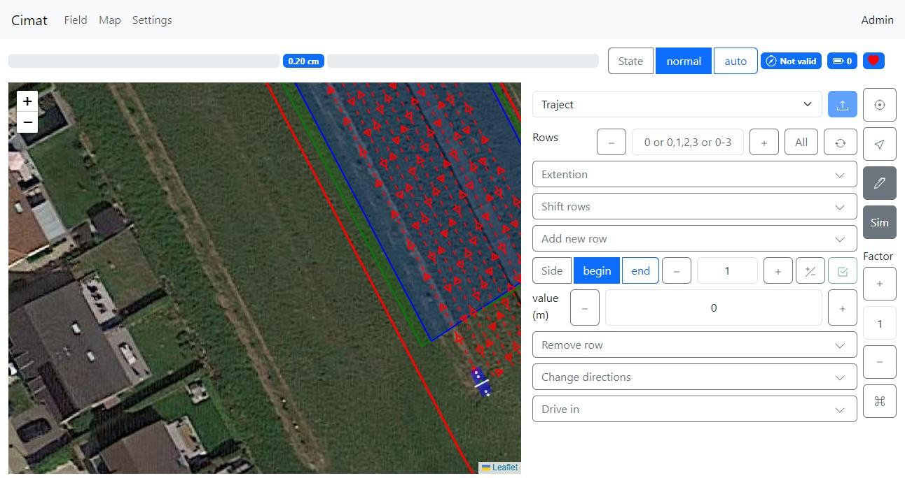
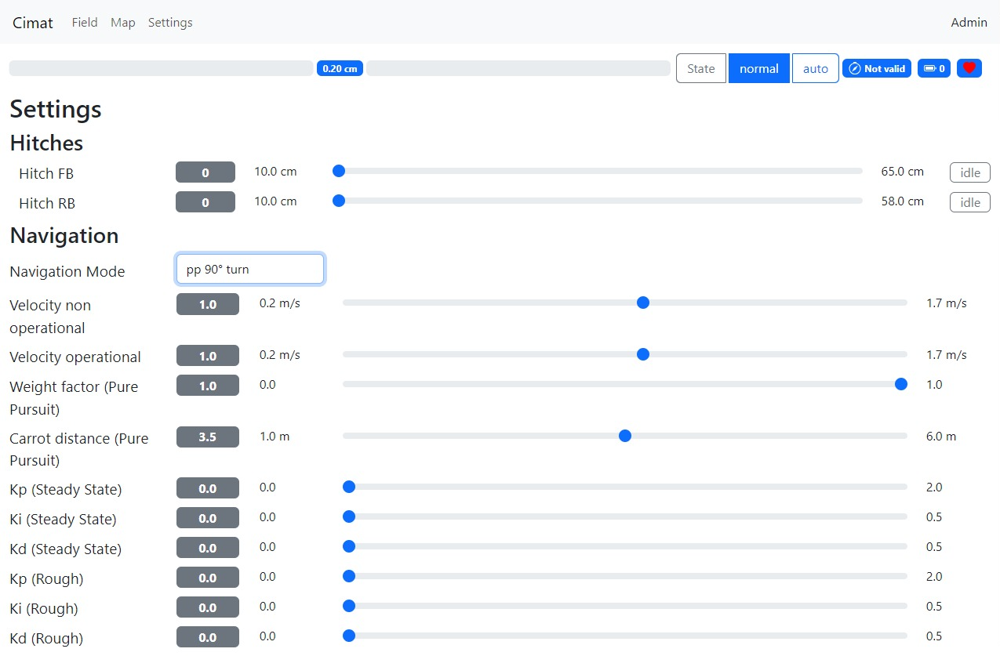
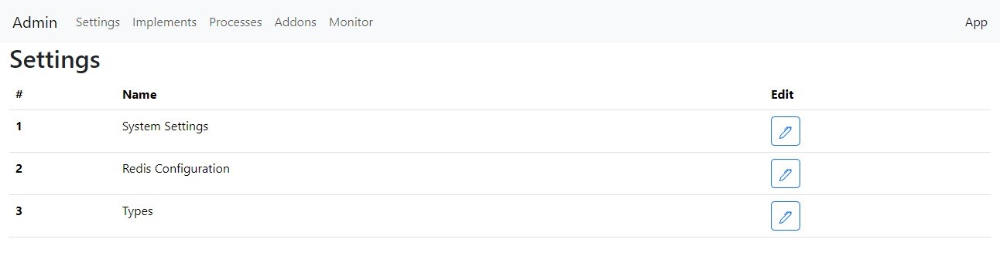
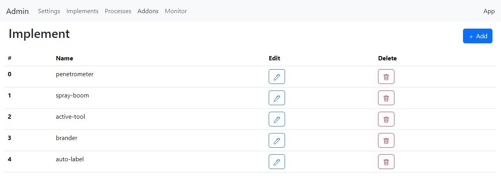
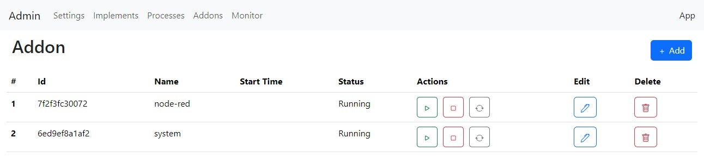

.. _addons:

Add-ons
=======

Introduction
------------

Add-ons are Docker containers that run on the same system as the *operational layer*.
The :cpp:class:`SystemManager` process maintains the add-ons and can start, stop, and update the add-on at request.
The add-ons in the system are configured using the :ref:`system add-on web app <addon_system>` in a JSON editor, using the `Docker Engine API (1.46) <https://docs.docker.com/engine/api/v1.46/>`_ syntax.

Python package
--------------

A python package supports new python-addons. The package provides the interaction with the *operational layer* including:

   1. *ARTOF Redis interface* interaction
   2. Field manipulation
   3. Platform configuration access

You can find the source code of the python package in the `artof-utils <https://github.com/artof-ilvo/artof-utils>`_ project.

.. _addon_system:

System add-on
-------------

The system add-on is implemented in python-Django and provides a web application to configure the robot.
By default, the web application is hosted at port 80 on the computer running the add-on.
Switch the *App and Admin area* in the upper right corner.

App area
^^^^^^^^

Navigation bar
""""""""""""""
The top navigation bar in the *App area* visualizes

+ the error bar, indicating the navigation error of the robot during navigation;
+ the navigation state (normal, auto, steer, throttle);
+ the GNSS fix state |icon_compass| (Not valid, Float, Fix);
+ the heartbeat |icon_heart_fill| (Pulses at 2Hz).

Field
"""""

The *Field Tab* is the first tab you see when browsing the web application.
This tab gives an overview of the available *Fields* in the system.

   **Figure 1.** Tab App: Field

+ Select another field by pressing the |icon_check| button.
+ Duplicate a field using the grey |icon_copy| button.
+ Edit a field by clicking on the |icon_pen| button.
+ Download a field by pressing the |icon_download| button.
+ Delete a field by clicking on the |icon_trash| button.

New field
"""""""""

To create a trajectory, geofence or task, you can select the following:

+ ``original`` you maintain the trajectory allocated to this field (only applicable when editing a field)
+ ``file`` you can upload the shapefile of a Linestring.
+ ``draw`` you can draw the Linestring using the tools on the map.
+ ``drive`` you can drive in the AB line in the *Tab Map*.

.. note::

   When you upload a shape file, you must upload the files with the extensions ``cpg``, ``dbf``, ``prj``, ``shp`` and ``shx``.
   So, five files are selected in total.

.. note::

   Always click on the |icon_check| button when performing a change. When the change is successful, the section folds in and highlights green; otherwise, the results are not saved.
   When you're done, click the ``Done`` button to return to the Tab Field.

1. Change the field name ``New`` to your desired field name and press the check icon button (*Figure 2*)
2. Create a trajectory
3. Create geofence
4. Add one or more tasks (*Figure 3*)

   **Figure 2.** Tab App: Edit Field (alter the name)

   **Figure 3.** Tab App: Edit Field (optionally add a task)

Map
"""

The *Map* gives an overview of the robot during operation.

On the map you can see:

+ The robot: blue rectangle

+ The hitch hinges and hitch pens: white dots

   + Hitch hinges become red when a *hitch task*  activates the hitch.

+ The sections: white rectangles

   + The sections become red when activated by a *continuous, discrete or intermittent task*.

+ The green dots are visualizations of the navigation algorithm, including the robot reference, the closest point on the trajectory, and the look-ahead point.

+ The geofence: red polygon

+ The traject: red line with direction arrows

+ The tasks: green, blue, ..., depending on the task type

   **Figure 4.** Tab App: Map

The right sidebar contains additional tools.

+ The |icon_crosshair| button always places the robot in the center of the map.

+ The |icon_cursor| button toggles the north direction of the map.

+ The |icon_pen| button opens the field edit tools (*Figure 5*).

   + With the first item selector, you can select every field layer (traject, geofence, task 1, task 2, etc.).

   + For a ``traject`` the

      + Row selected in the ``Rows`` text field can be extended, shifted or deleted.

      + Rows can be added at the beginning or end of the trajectory.

      + With the ``Drive in`` button you can drive in a new AB line. Not that this overwrites the previous trajectory.

   + For a polygon line shape such as a geofence or continuous task the polygon can be buffered

+ The ``Sim`` button activates *simulation mode*. When the *operational layer* communicates *mechatronic layer*, the robots go in *Hardware In The Loop (HIL) testing*; if not, you perform an *integration test* in the *operational layer*.

   + With the simulation ``Factor``, you can multiply the simulation speed.

   + The |icon_command| button at the bottom allows you to position the robot with a left mouse click. After that, you can also navigate the robot in simulation mode using the arrows on the keyboard. This is, of course, independent of the mechatronic layer and the behaviour of the attached physical robot.

.. note::

   When performing changes with the |icon_pen| tools, a preview of the changes is visualized in black on the map.
   Press the |icon_check| button to confirm your change and the |icon_upload| button to upload it to the robot.

   **Figure 5.** Tab App: Map Edit

Settings
""""""""

The *Settings* are used to configure the operational functionality of the robot platform. You can configure

+ the navigation mode, as explained in :ref:`basic_concepts_platform`.

+ the operational and non-operational velocity. The robot uses the operational velocity when it is in a task polygon; otherwise, it uses the non-operational velocity.

+ the hitch height, and if provided by the robot's hardware, the ``float`` mode.

+ Navigation controller parameters.

   **Figure 6.** Tab App: Settings

Admin area
^^^^^^^^^^

.. _addon_system_admin_settings:

Settings
""""""""

In the admin *Settings*, the :ref:`configuration files <basic_concepts>` can be edited with a JSON editor by pressing the |icon_pen| button.
After editing, press the Format |icon_json| button to check syntax errors and submit the changes with the |icon_upload_box| button.

.. note::
   Changes in the admin *Settings* require a restart of the robot (computer).

   **Figure 6.** Tab Admin: Settings

Implements
""""""""""

You can add, remove or alter implements with the JSON editor.

   **Figure 6.** Tab Admin: Implements

+ Add a new implement using the |icon_plus| button.

+ Remove an implement by pressing the |icon_trash| button.

+ Alter an implement by pressing the |icon_pen| button.

.. note::
   When you are modifying an enabled implement in the selected field, you first need to toggle another field for the changes to occur.

Processes
"""""""""

The *Process Tab* lists information on the processes like starting time, state, etc.

   **Figure 7.** Tab Admin: Implements

+ Start the process by pressing the |icon_play| button.

+ Stop the process by pressing the |icon_stop| button.

+ You can see the process configuration by pressing the |icon_pen| button (you cannot edit a process, so the submit |icon_upload_box| button is disabled).

Add-ons
"""""""

The *Add-on Tab* lists basic information about add-ons in the system, such as their starting time and status.

   **Figure 8.** Tab Admin: Add-ons

+ Add a new add-on using the |icon_plus| button.

+ Start the add-on by pressing the |icon_play| button.

+ Stop the add-on by pressing the |icon_stop| button.

+ Update the add-on by pressing the |icon_repeat| button. The latest docker version of the add-on online available is pulled and installed.

+ Edit the add-on by pressing the |icon_pen| button.

+ Delete the add-on by pressing the |icon_trash| button.

.. note::
   The add-on configuration uses the `Docker Engine API (1.46) <https://docs.docker.com/engine/api/v1.46/>`_ syntax.

Monitor
"""""""

Except for JSON variables, you can monitor all :ref:`Redis variables <basic_concepts_interfaces>` in the *Monitor Tab* on the system.
Use the search bar to find a specific variable.
Modify values by editing the new value in the ``Edit`` text field and press the |icon_upload_cloud| for the change to occur.

.. note::

   Altering ``plc.monitor`` does not have any effect, as it is immediately updated again by the :cpp:class:`PlcVariableManager`.

.. _addon_node_red:

Node-red add-on
---------------

The node-red add-on can be reached at the URL http://robotframework:1880/. Change "robotframework" to the robot's IP address.

You can install the submodules for extracting the Redis variables and logging them to an InfluxDB instance by

*<Coming soon>*

.. Icons

.. |icon_crosshair| raw:: html
   :file: icons/crosshair.html

.. |icon_cursor| raw:: html
   :file: icons/cursor.html

.. |icon_pen| raw:: html
   :file: icons/pen.html

.. |icon_heart_fill| raw:: html
   :file: icons/heart-fill.html

.. |icon_copy| raw:: html
   :file: icons/copy.html

.. |icon_compass| raw:: html
   :file: icons/compass.html

.. |icon_download| raw:: html
   :file: icons/download.html

.. |icon_trash| raw:: html
   :file: icons/trash.html

.. |icon_check| raw:: html
   :file: icons/check2.html

.. |icon_command| raw:: html
   :file: icons/command.html

.. |icon_upload| raw:: html
   :file: icons/upload.html

.. |icon_upload_box| raw:: html
   :file: icons/box-arrow-in-up.html

.. |icon_upload_cloud| raw:: html
   :file: icons/cloud-upload.html

.. |icon_json| raw:: html
   :file: icons/json.html

.. |icon_plus| raw:: html
   :file: icons/plus.html

.. |icon_stop| raw:: html
   :file: icons/stop.html

.. |icon_play| raw:: html
   :file: icons/play.html

.. |icon_repeat| raw:: html
   :file: icons/arrow-repeat.html