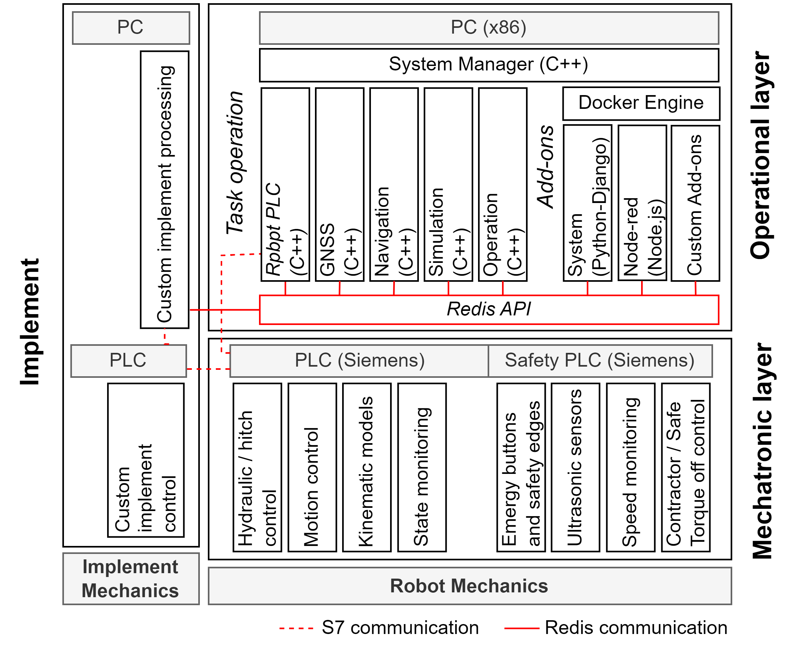

Architecture
============

Overview
--------
The framework architecture is shown in the figure below.

The ARTOF Redis API maintains the communication between the operational layer, the add-ons and other network devices or implements.

#. The **mechatronic layer** controlled the hardware components, integrated the inverse and direct kinematic models, interacting with the remote controller, enabled hitch operation, interfaced implements and integrated the machine safety state diagram by interaction with the SRP/CS.
#. The **operational layer** provided the functionality related to real-time autonomous task map execution based on GNSS navigation.
#. The **add-ons** run in docker containers and provide additional functionality. The system is shipped with

   + The *system add-on* provides a web page for user interaction.
   + The *node-red add-on* provides flow programming functionality, used for logging and implement interaction.

Mechatronic layer
-----------------

Introduction
^^^^^^^^^^^^

The mechatronic layer requires a custom implementation.
It depends on the vehicle configuration, the selected components and the safety concept for the platform.
The robot platforms developed at ILVO used Siemens technology to control its industrial components.

Platform requirements
^^^^^^^^^^^^^^^^^^^^^
The ARTOF framework can be integrated after-marked or during the development of a new robot platform.

The minimal hardware requirements to perform steering guidance are:

#. **Safety** the implementation of the mechatronic layer is responsible for all the safety features of the platform in accordance to the national legislation.
#. **Programmable Logic Controller** A PLC interacts with all the actuators and sensors on the platform. The functionality that needs to be implemented are:

   + Execution of the *inverse and direct kinematic model* and operates the steering and driving actuators accordingly.
   + Example components: Siemens S7-1200 and Siemens S7-1500 series

#. **Steering angle control**: The steering angle needs to be controlled by the PLC.

   + For *hydraulic steering* this was done using a hydraulic steering block.
   + For *electric steering* this was done by controlling the motor drive.
   + *Example components*: `Raven RS1 <https://nl.ravenind.com/ag-products/guidance/rs1>`_

#. **Steering angle feedback**: The steering angle needs to be monitored by the PLC to enable closed-loop steering control.

   + For *Ackerman steering* robots this was done with an inductive angle sensor on the steering rack.
   + For *4WD4WS steering* robots all wheel angles need to be measured. This was also done using inductive angle sensors.
   + *Example components*: `Multiprox RI360P1-QR20-LU4X2-H1141 <https://www.turck.nl/nl/product/100000186>`_

#. **Velocity control**: The driving velocity needs to be controlled by the PLC.

   + For *hydraulic traction* this was done by controlling the swash plate by an electric actuator.
   + For *electric traction* this was done by setting the motor drives in velocity control.
   + For robots also enabling paddle velocity control for the driver an electronic analogue paddle was used.

#. **Velocity feedback**: The driving velocity needs to be monitored by the PLC to enable closed-loop velocity control.

   + For robots with *hydraulic transmission* this was done by a rotary encoder and two interlocking cogs.
   + For robots with *electrical transmission* this was done by reading in the hall-sensor, sin/cos encoder, etc.

Additional requirements to operate a robot platform:

#. **Hitch control**: The hitches need to be controlled by the PLC.

   + For *hydraulic hitches* this was done using electric valves.

#. **Hitch angle feedback**: The hitch angles need to be monitored by the PLC to enable closed-loop hitch height control.

   + *Example components*: `Multiprox RI360P1-QR20-LU4X2-H1141 <https://www.turck.nl/nl/product/100000186>`_

.. note::

   All safety measures must be implemented within the mechatronic layer in accordance with national legislation.
   The operational layer does not include any safety features and should only be used on products that are CE marked for autonomous operation.

Interface
^^^^^^^^^
The **Siemens S7-communication protocol (Snap7)** is currently the only supported interface between the *mechatronic layer* and the *operational layer* that is implemented in the ARTOF framework.
At the PLC a *higherLevelMonitor* and *higherLevelControl* data block are maintained, from which the content is read and written respectively at every program cycle of the *operational layer* process *Robot PLC*.

At the PLC side the checkbox ``Permit Access with PUT/GET Communication from Remote Partner`` need to be set. This can be found back in the `Siemens documentation <https://cache.industry.siemens.com/dl/files/115/82212115/att_108330/v2/82212115_s7_communication_s7-1500_en.pdf>`_.

More information on this interface can be found in section :ref:`layer_interface`.

Kinematic model
^^^^^^^^^^^^^^^

Operational layer
-----------------

Introduction
^^^^^^^^^^^^

All processes in the operational layer is implemented in Cplusplus (CPP).
The implementation can be found back in the `operational-layer <https://github.com/artof-ilvo>`_ project.

Platform requirements
^^^^^^^^^^^^^^^^^^^^^

#. **RTK GNSS localisation (with heading)**  : The framework includes a driver for the `Septentrio Mosaic-H <https://www.septentrio.com/en/products/gnss-receivers/gnss-receiver-modules/mosaic-h>`_ module.

   + *Example components*: `SimpleRTK3B Heading <https://www.ardusimple.com/product/simplertk3b-heading/>`_

#. **Computer**: The computer runs the operational layer and the add-ons.

   + *Tested on*:

+-------------+--------------+--------------------------------------------+----------+
| Brand       | Model        | CPU                                        | Memory   |
+=============+==============+============================================+==========+
| Asus        | Gigabyte     | Intel(R) Core(TM) i5-10210U CPU @ 1.60GHz  | 60 GB    |
+-------------+--------------+--------------------------------------------+----------+
| Intel       | NUC          | Intel(R) Core(TM) i7-                      |          |
+-------------+--------------+--------------------------------------------+----------+
| Intel       | NUC          | ...                                        |          |
+-------------+--------------+--------------------------------------------+----------+

Configuration files
^^^^^^^^^^^^^^^^^^^

.. _layer_interface:

Interface configuration
"""""""""""""""""""""""
The ``config.json`` configuration file describes the Redis variables in the system as well as the *mechatronic/operational layer interface* configuration

.. literalinclude:: files/configuration/config.json
   :language: JSON
   :caption: The ``config.json`` file of the CIMAT robot

The ``protocols`` object defines the protocol configuration.

#. ``snap7``: provides the *mechatronic/operational layer interface* parameters:

   + the IP address of the PLC
   + the read and write data block (DB), which correspond with the *higherLevelMonitor* and *higherLevelControl*
   + the rack and slot of these data blocks

#. ``redis``: provides the *Redis ARTOF interface* parameters:

   + the IP address and port of the Redis server

The ``variables`` object defines the ``plc`` and ``pc`` Redis varialbes on the system.

#. ``plc`` variables: the ``monitor`` variables are read and the ``control`` variables are written to the PLC using the *S7-communication protocol (Snap7)* by the :cpp:class:`RobotPLC`. These variables are continuously synced between the *operational and mechatronic layer*.

#. ``pc`` variables are solely used by the operational layer and require no synchronisation with the mechatronic layer.

The configuration depends on the platform configuration (vehicle configuration, how many hitches, what energy source, ...).

The recurrent, composite types are described in the ``types.json`` file. An extract of the ``types.json`` configuration file is shown below.
Not shown in the extract is that types also can be nested.

.. literalinclude:: files/configuration/types.json
   :language: JSON
   :caption: ``types.json`` file

Redis variables that need configuration are listed in the ``redis.init.json`` file, such as shown in the ``variables`` object in the code block below.
Next to information about the initialization of the Redis variables in contains information related to the processes and jobs that need to run.
The latter is later discussed in :ref:`system_manager`.

.. literalinclude:: files/configuration/redis.init.json
   :language: JSON
   :caption: ``redis.init.json`` file of the CIMAT robot

Platform configuration
""""""""""""""""""""""

The ``settings.json`` file describes the platform configuration of the robot platform.

.. literalinclude:: files/configuration/settings.json
   :language: JSON
   :caption: ``settings.json`` file of the CIMAT robot

These settings include:

+ ``name``: The name of the robot platform

+ ``robot``: The robot platform configuration

   + The dimensions of the robot platform (``width``, ``height``, ``wheel_diameter``)
   + The ``transform`` (**T**: translation in m, **R**: rotation in euler angles) to the reference of the robot.
      + For a 4WD4WS robot this coincides with the geometric center of the robot.
      + For an Ackerman robot this is the center of the rear axle. In that case also the ``transform_center`` needs to be added in the ``robot`` configuration object.

+ ``auto_velocity``: ``min`` and ``max`` velocity of the platform.

+ ``nav_modes``: The navigation modes of the robot. This depends on the vehicle configuration, different navigation modes are possible at the headacre. In the image below the navigation modes are shown with there corresponding id:

   #. 90°: When a corner is reached, the robot turns around its axis for the angle of the corner.

   #. 180°: When a headacre is reached, the robot turns around its axis until it reaches the same orientation of the new trajectory line to follow. Than it navigates sideways until reaching the corner of the next trajectory line.

   #. pure pursuit: When a headacre is reached, the robot drives a circle with the platform turning radius specified in the ``platform.json`` configuration file.

   #. rollback: When a headacre is reached, the robot drives a quarter of a circle with the platform turning radius. It rolls back when the corner with the next trajectory line was passed and turns in again to follow the new trajectory line.

   #. external: An external controllor can take over and perform the navigation, by updating the ``navigation_control`` parameters.

.. image:: images/fig_navigation_modes.png
   :width: 70%
   :alt: Navigation modes with navigation id
   :align: center

+ ``nav_modes``: The modes for autonomous navigation.

   #. Full auto: performs autonomous velocity control and steering
   #. Auto steer: performs only autonomous steering (no velocity control)
   #. Auto throttle: performs only autonomous velocity control (no steering)

+ ``hitches``: The specifications of the different hitches on the platform

   #. ``id``: hitch id

   #. ``name``: name of the hitch

   #. ``min``: min height of the hitch (cm)

   #. ``max``: max height of the hitch (cm)

   #. ``transform`` to the hitch pen

   #. ``types``: Compatible task types with the hitch.

      #. *hitch*: The hitch is activated (lowered) when the hitch centre is contained by a polygon of the task map.

      #. *continuous*:  The section is activated when it intersects with a polygon of the task map. A special type of this is a *cardan* task, which activates the cardan when intersecting the polygon(s) in the task map.

      #. *intermittent*: The section is activated when it contains a point of the task map.

      #. *discrete*: The discrete action (measurement) is performed when the section is the closest to the point of the task map.

.. image:: images/fig_task_types.png
   :width: 70%
   :alt: Task types compatible with the hitch
   :align: center

Processes
^^^^^^^^^

VariableManager
"""""""""""""""

All processes in the operational layer inherit the :cpp:class:`VariableManager`, which performs basically process housekeeping.

During initialization, it loads a :cpp:member:`VariableMap::variableMap` of ``typedef std::map<std::string, VariablePtr> VariableMap``

The pseudocode below illustrates what it does

.. code-block:: cpp
   :caption: Pseudocode :cpp:class:`VariableManager` main loop

      while (true) {
         // start a clk cycle (f = 20 Hz => T = 50 ms)
         clk.start();
         // Read all Redis variables
         readRedisVariables();
         // Execute process specific code
         serverTick();
         // Write Redis variables (only those who were altered during the cycle)
         writeRedisVariables();
         // Communicate process health
         toggleHeartBeatPulse();
         publishProcessingTime(clk.poll());
         // Stop the clk cycle (sleep for the remaining time)
         clk.stop();
      }

#. The :cpp:member:`Clk::clk` member of the :cpp:class:`VariableManager` class supports process execution at a fixed frequency, which is by default configured to ``20 Hz``. When the main loop executes more quickly the additional time is waited at the :cpp:func:`void Clk::stop()` method, otherwise the process is immediately continued.
#. The :cpp:func:`void readRedisVariables()` and :cpp:func:`void writeRedisVariables()` methods perform block read and write the Redis variables described in the redis configuration file at once. For the :cpp:func:`void writeRedisVariables()` only the

.. _system_manager:

SystemManager
"""""""""""""

``platform.json`` configuration file

Blabla