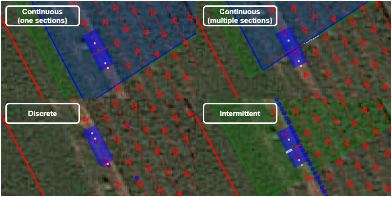
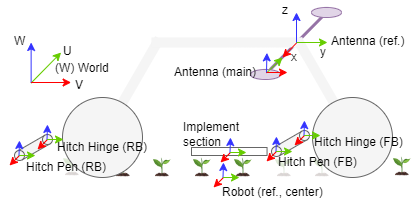
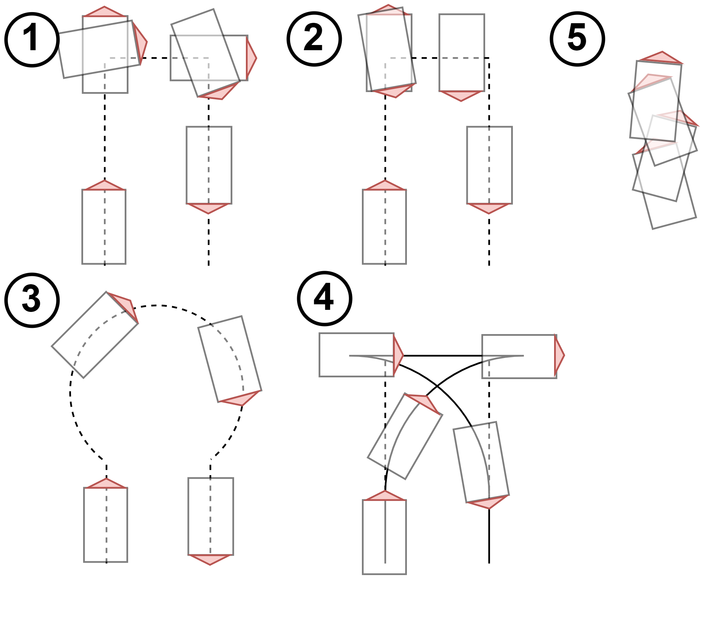

.. _basic_concepts:

Basic concepts
==============

Field
-----

A field describes the entire field operation in the :ref:`system add-on web app <addon_system_admin_settings>`.
It exists out of shapefiles with the Coordinate Reference system (CRS) WGS84 or UTM.

And includes:

1. ``traject``: A trajectory is mandatory when executing a field operation. The shapefile is of type Linestring.
2. ``geofence``: A geofence is also mandatory when executing a field operation. The shapefile is of type polygon.
3. ``tasks``: Tasks are optional and describe the robot's actions at specific locations. The following *task types* exist

   + *hitch*: The hitch is activated (lowered) when a polygon of the task map contains the hitch centre.

   + *continuous*:  The section is activated when it intersects with a polygon of the task map. A particular type of this is a *cardan* task, which activates the Power Take Off (PTO) when intersecting the polygon (s) in the task map.

   + *intermittent*: The section is activated when it contains a point on the task map.

   + *discrete*: The discrete action (measurement) is performed when the section is the closest to the point of the task map.

   **Figure 1.** Task types compatible with the hitch

.. _basic_concepts_platform:

Platform
--------
The platform abstracts the robot's capabilities and includes information such as dimensions, the number and position of the hitches, the vehicle configuration, etc.
The ``settings.json`` file describes the platform configuration and can be edited in the :ref:`system add-on web app <addon_system_admin_settings>` JSON editor.

.. literalinclude:: files/configuration/settings.json
   :language: JSON
   :caption: **Listing 1.** ``settings.json`` file of the CIMAT robot

The fields in the ``settings.json`` file are:

1. ``name``: The name of the robot platform

2. ``robot``: The robot platform configuration

   2.1. The dimensions of the robot platform (``width``, ``height``, ``wheel_diameter``)

   2.2. The ``transform``, including a translation (in meters) and a rotation in Euler angles (degrees) to the reference point on the robot. This reference point is always measured from the ground on.

      + For a 4WD4WS robot, this can coincide with its geometric center.

      + For an Ackerman robot, this is the center of the rear axle. In that case, the ``transform_center`` must also be added to the ``robot`` configuration object.

   **Figure 2.** Robot transformations: consider the antenna reference coordinate system; the ``y`` axis is pointing forwards, the ``z`` axis upwards, and the ``x`` axis follows the right-handed rule.

3. ``auto_velocity``: ``min`` and ``max`` velocity of the platform.

4. ``nav_modes``: The possible navigation modes of the robot depend on the vehicle configuration. Different navigation modes are possible at the headacre. The navigation modes are shown in *Figure 3* with their corresponding ID.

   + *90° spinning*: When the robot reaches a corner, it turns around its axis to match the angle of the corner.

   + *180° spinning*: When the robot reaches a headacre, it turns around its axis until it reaches the exact orientation of the new trajectory line to follow. Then, it navigates sideways until reaching the corner of the subsequent trajectory line.

   + *pure pursuit*: When the robot reaches a headacre, it drives a circle with the platform turning radius specified in the ``platform.json`` configuration file.

   + *rollback*: When the robot reaches a headacre, it drives a quarter of a circle with the minimum platform turning radius. The robot rolls back when it cannot turn into the following trajectory line until there is enough space to perform the turning. Then, it turns a quarter of a circle again with the minimum platform turning radius to come on the following trajectory line.

   + *external*: An external controller can take over and perform the navigation by updating the ``navigation_control`` parameters.

   **Figure 3.** Navigation modes with navigation id

5. ``auto_modes``: The modes for autonomous navigation.

   + *Full auto*: performs autonomous velocity control and steering

   + *Auto steer*: performs only autonomous steering (no velocity control)

   + *Auto throttle*: performs only autonomous velocity control (no steering)

6. ``hitches``: The specifications of the different hitches on the platform

   6.1. ``id``: hitch id

   6.2. ``name``: name of the hitch

   6.3. ``min``: min height of the hitch (cm)

   6.4. ``max``: max height of the hitch (cm)

   6.5. ``transform`` to the hitch hinge (see *Figure 2*)

   6.6. ``types``: Compatible task types with the hitch.

7. ``gps``: The RTK GNSS configuration.

   7.1. ``device``: can be *serial* for USB devices or *socket* for network devices.

   7.2. ``utm_zone``: EPSG:326xx whereby xx is the UTM zone.

   7.3. ``usb_port`` or ``ìp`` and ``port``: depending on the device, this can be the USB device name or the IP and port of the socket.

   7.4. NTRIP configuration ``ntrip_server``, ``ntrip_mountpoint``, ``ntrip_uname``, ``ntrip_pwd``

   7.5. ``antenna_rotation``: additional rotation of the antennas in degrees

      + 0 or 180 if the antennas are in the longitudinal direction of the platform.

      + 90 or -90 if the antennas are in the lateral direction of the platform.

   7.6. ``transform`` to the GNSS reference (see *Figure 2*)

Implements
----------

The ``<implement-name>.json`` files describe the implement configuration and can be edited in the :ref:`system add-on web app <addon_system_admin_settings>` JSON editor.

The fields in the ``<implement-name>.json`` file are:

1. ``name``: the implement name <implement-name>

2. ``name``: whether the task needs to be executed on the task map. If not, the sections can be operated by an add-on or program on another computer.

3. ``types``: the types compatible with the implement. These are the same types *continuous*, *intermittent*, *discrete* as explained in *Figure 2*. An implement can support multiple types (see *Listing 2*).

.. literalinclude:: files/implements/auto-label.json
   :language: JSON
   :caption: **Listing 2.** Implement supporting multiple types

4. ``sections``: this is an array of sections.

   4.1. ``id`` of the section (string)

   4.2. The dimensions ``width``, ``up``, ``down`` in meters.

   4.3. ``transform`` to the hitch pen (see *Figure 2*)

   4.4. A section can be repeated over a certain distance by filling in the ``repeats`` and ``offset`` fields as in *Listing 3*.

.. literalinclude:: files/implements/spray-boom.json
   :language: JSON
   :caption: **Listing 3.** Implement with an array of sections configured by the ``repeats`` and ``offset`` fields

.. _basic_concepts_interfaces:

Interfaces
----------

The `config.json` file describes the system's Redis variables and the *mechatronic/operational layer interface configuration*.
You can edit the configuration file in the :ref:`system add-on web app <addon_system_admin_settings>` JSON editor.

.. literalinclude:: files/configuration/config.json
   :language: JSON
   :caption: **Listing 4.** The ``config.json`` file of the CIMAT robot

The fields in the ``config.json`` file are:

1. The ``protocols`` object defines the protocol configuration.

   1.1. ``snap7``: provides the *mechatronic/operational layer interface* parameters:

      1.1.1. the ``ip`` address of the PLC

      1.1.2. the ``read_db`` and ``write_db`` data block (DB), which correspond with the *higherLevelMonitor* and *higherLevelControl*

      1.1.3. the ``rack`` and ``slot`` of these data blocks

   1.2 ``redis``: provides the *Redis ARTOF interface* parameters:

      1.2.1 ``ip`` and ``port``: the IP address and port of the Redis server

2. The ``variables`` field defines the ``plc`` and ``pc`` Redis variables on the system.

   2.1. ``plc`` variables: these variables are continuously synced between the *operational and mechatronic layer*.

      2.1.1 the ``monitor`` variables are read *S7-communication protocol (Snap7)* by the :cpp:class:`RobotPLC`

      2.1.2 the ``control`` variables are written *S7-communication protocol (Snap7)* by the :cpp:class:`RobotPLC`

   2.2. ``pc`` variables are solely used by the operational layer and require no synchronization with the mechatronic layer.

The configuration depends on the platform configuration (vehicle configuration, number of hitches, energy source, etc.).

The ``types.json`` file describes recurrent composite types.
These types can be nested.

.. literalinclude:: files/configuration/types.json
   :language: JSON
   :caption: **Listing 5.** ``types.json`` file

The names of the Redis variables are the composition of the object names, e.g.
``plc.monitor.drive_fl.current``, ``plc.monitor.drive_fr.temperature``, ``plc.monitor.hitch_fb.feedback_sections.27``, ``plc.control.navigation.heartbeat``, ``plc.control.hitch_fb.activate_sections.30``, ``pc.navigation.turning_radius``, ``pc.purepursuit.carrot_distance``

Redis variables that need configuration are listed in the ``redis.init.json`` file, as shown in the ``variables`` object in *Listing 4*.

Besides, the ``redis.init.json`` file contains information related to the processes and jobs that need to run.
The latter is discussed in :ref:`jobs`.

.. literalinclude:: files/configuration/redis.init.json
   :language: JSON
   :caption: **Listing 6.** ``redis.init.json`` file of the CIMAT robot

.. _jobs:

Jobs
----

Also, in the ``redis.init.json`` file, the jobs are described.
The ``redis.init.json`` must be configured at installation.

A :cpp:class:`Job` is the abstraction for a :cpp:class:`Process` and an :cpp:class:`Addon`.

A :cpp:class:`Process` is an entry for the :cpp:class:`SystemManager` process, which maintains the processes in the *operational layer*.
The *operational layer* processes are further discussed in the :ref:`operational_layer` section.

A :cpp:class:`Addon` is an entry for the :cpp:class:`SystemManager` process, which maintains the system's add-ons.
The add-on configuration uses the `Docker Engine API (1.46) <https://docs.docker.com/engine/api/v1.46/>`_ syntax.
The add-ons are further discussed in the :ref:`addons` section.

.. _basic_concepts_states:

States
------

Based on the GNSS coordinates and the robot and implement geometry, the ARTOF framework continuously maintains the state of the platform in Redis JSON variables:

+ the ``gps.raw.state``: the UTM XYZ position and heading measured by the GNSS receiver (at the dominant antenna).

+ the ``gps.ref.state``: the position of the dominant antenna transformed to a virtual point in the center of the two antennas.

   + Configuration of ``gps`` ``transform`` in the ``settings.json`` file.

+ the ``robot.ref.state``: the mass centre of the robot, used as a reference point for the pure pursuit navigation controller

   + Configuration of ``robot`` ``transform`` in the ``settings.json`` file.

+ the ``robot.center.state``: the geometric centre of the robot, used for visualization.

   + Configuration of ``robot`` ``center`` in the ``settings.json`` file.

+ the ``robot.head.state``: the head of the robot, used as a reference point for the PI navigation controller (only for 4WD4WS vehicle configurations).

   + Configuration of ``robot`` ``head`` in the ``settings.json`` file.

+ the ``hitch.states``: the states of the hitches.

   + Configuration of ``hitches`` ``hitch_<name>`` ``transform`` in the ``settings.json`` file.

+ the ``implement.states``: the states of the different implements and their sections.

   + Configuration of the ``<implement-name>.json`` file.

