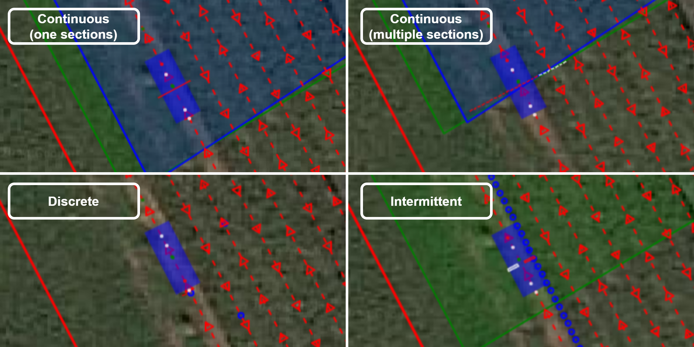

.. _basic_concepts:

Basic concepts
==============

Field
-----

A field describes the entire field operation in the :ref:`system add-on web app <addon_system_admin_settings>`.
It exists out of shapefiles with the Coordinate Reference system (CRS) WGS84 or UTM.

A field includes:

1. ``traject``: A trajectory is mandatory when executing a field operation. The shapefile is of the shape type Linestring.
2. ``geofence``: A geofence is also mandatory when executing a field operation. The shapefile is of the shape type polygon.
3. ``tasks``: Tasks are optional and describe the robot's actions at specific locations. The following *task types* exist

   + *hitch*: The hitch is activated (lowered) when a polygon of the task map contains the hitch centre.

   + *continuous*:  The section is activated when it intersects with a polygon of the task map. A particular type of this is a *cardan* task, which activates the Power Take Off (PTO) when intersecting the polygon (s) in the task map.

   + *intermittent*: The section is activated when it contains a point on the task map.

   + *discrete*: The discrete action (mostly a measurement) is performed when the section is the closest to the point of action on the task map.

   **Figure 1.** Task types

.. _basic_concepts_platform:

Platform
--------
The platform abstracts the robot's capabilities and includes information such as dimensions, the number and position of the hitches, the vehicle configuration, etc.
The ``settings.json`` file describes the platform configuration and can be edited in the :ref:`system add-on web app <addon_system_admin_settings>` JSON editor.

.. literalinclude:: files/configuration/settings.json
   :language: JSON
   :caption: **Listing 1.** ``settings.json`` file of the CIMAT robot

The fields in the ``settings.json`` file are:

1. ``name``: The name of the robot platform

2. ``robot``: The robot platform configuration

   2.1. The dimensions of the robot platform (``width``, ``height``, ``wheel_diameter``)

   2.2. ``transform``: The translation (in meters) and rotation in Euler angles (degrees) of the different robot components to the antenna reference point on the robot. The robot reference point is measured from the ground on and is used by the navigation algorithms, to calculate the robots position in respect to the trajectory.

      + For a 4WD4WS robot vehicle configuration, the robot reference coincides with its geometric center.
      + For an Ackerman robot, the robot reference coincides with the centre of mass. In the case this does not equal the robot center, this transformation is written under the ``transform_center`` field of the ``robot`` configuration object.

   **Figure 2.** Robot component transformations, expressed relative to the antenna reference

3. ``auto_velocity``: ``min`` and ``max`` velocity of the platform.

4. ``nav_modes``: The allowed navigation modes. Depending on the robot platforms' vehicle configuration, different headland turns are possible. The navigation modes determine these headland turns and are shown in *Figure 3* with their corresponding ID.

   + *90° spinning*: When the robot reaches a corner, it rotates around its axis until its orientation matches the direction of the next trajectory line it needs to follow. This basic turning process applies to both regular corners and headland turns.

   + *180° spinning*: When the robot reaches a headland turn, it first rotates around its axis until it aligns with the direction of the next row it needs to follow. After aligning with the new row's trajectory, the robot moves sideways toward the corner where this new row begins. Once it reaches the corner, the robot continues driving along the trajectory line of the new row. The navigation mode *90° spinning* is used when the turns are regular corners.

   + *pure pursuit*: When the robot encounters a corner, it will navigate the turn by driving in a circular path. The radius of this circle is determined by the turning radius specified in the platform.json configuration file. If the corner is part of a headland turn (where the two rows of the field are closer together than twice the minimum turning radius), the robot will instead drive along a circular arc that connects the two rows. This arc will have the minimum turning radius, allowing the robot to smoothly transition from one row to the next within the limited space.

   + *rollback*: When the robot reaches a headland turn, it initially turns by driving in a quarter-circle, using the minimum turning radius specified for the platform. If the robot doesn't have enough space to align with the next trajectory line, it will move backward to create the necessary space. Once there is enough room, the robot makes another quarter-circle turn with the minimum turning radius, aligning itself with the new trajectory line and continuing on its path.

   + *external*: An external controller can take control of the robot's navigation by updating the navigation_control parameters. This allows the external controller to direct the robot's movements, overriding the robot's default navigation system.

.. figure:: images/fig_navigation_modes.png
   :width: 70%
   :align: center

   **Figure 3.** Navigation modes with their navigation id

5. ``auto_modes``: The different modes for autonomous navigation.

   + *Full auto*: The robot operates fully autonomous, with autonomous velocity- and steering control.

   + *Auto steer*: The robot only performs autonomous steering, and no autonomous velocity control. This mode provides "steering guidance" functionality.

   + *Auto throttle*: The robot only performs autonomous velocity control, and no autonomous steering control. This mode provides "cruise control" functionality.

6. ``hitches``: The specifications of the different hitches on the platform.

   6.1. ``id``: hitch id

   6.2. ``name``: name of the hitch

   6.3. ``min``: min height of the hitch (cm)

   6.4. ``max``: max height of the hitch (cm)

   6.5. ``transform`` to the hitch hinge (see *Figure 2*)

   6.6. ``types``: compatible task types with the hitch

7. ``gps``: The RTK GNSS configuration.

   7.1. ``device``: The device field is set *serial* for USB devices and *socket* for network devices.

   7.2. ``utm_zone``: The Universal Transverse Mercator (UTM) projection zone to complete the EPSG:326xx code whereby xx is the UTM zone.

   7.3. ``usb_port`` or ``ìp`` and ``port``: These parameters are device interface dependent. For a USB device the device name needs to be provided, and for a socket device the network- ip and port.

   7.4. NTRIP configuration ``ntrip_server``, ``ntrip_mountpoint``, ``ntrip_uname``, ``ntrip_pwd``

   7.5. ``antenna_rotation``: The antenna rotation describes an additional rotation of the antennas around the z-axis (in degrees).

      + 0 or 180 if the antennas are in the longitudinal direction of the platform.

      + 90 or -90 if the antennas are in the lateral direction of the platform.

   7.6. ``transform``: The transform field describes the transformation to the antenna reference (see *Figure 2*).

Implements
----------

The ``<implement-name>.json`` files describe the implement configuration and can be edited in the :ref:`system add-on web app <addon_system_admin_settings>` JSON editor.

The fields in the ``<implement-name>.json`` file are:

1. ``name``: The name of the implement.

2. ``on_taskmap``: This variable determines whether the task needs to be executed on the task map. If not, the sections can be operated by an add-on or program on another computer. If yes, the sections are operated according to the field configuration.

3. ``types``: The implement supports several types of operations: *continuous*, *intermittent*, and *discrete*, as illustrated in *Figure 2*. Some implements can handle multiple types of operations simultaneously. For example, the *auto-label* implement shown in *Listing 2* is designed for data collection using two cameras. The sections are defined by the cameras' fields of view. A camera can be activated in two scenarios: when the sections overlap with a specified polygon (a continuous task) or when a crop plant enters the field of view (an intermittent task).

.. literalinclude:: files/implements/auto-label.json
   :language: JSON
   :caption: **Listing 2.** Implement supporting multiple types

4. ``sections``: The sections are an array of the geometries and transformations of the implement sections.

   4.1. ``id``: The id of the section (string).

   4.2. The dimensions ``width``, ``up``, ``down`` in meters.

   4.3. ``transform``: The transformation of the center of the section to the hitch pen, visualized *Figure 2*.

   4.4. A section can be repeated over a specified distance by using the ``repeats`` and ``offset`` fields. This functionality allows for the configuration of implements with repetitive sections, such as the spray boom described in Listing 3. The spray boom consists of 24 sections, but only the transformation for the first section needs to be defined. The ``repeats`` and ``offset`` fields define how these sections are repeated along the boom.

.. literalinclude:: files/implements/spray-boom.json
   :language: JSON
   :caption: **Listing 3.** Implement with an array of sections configured by the ``repeats`` and ``offset`` fields

.. _basic_concepts_interfaces:

Interfaces
----------

The ``config.json`` file describes the system's Redis variables and the *mechatronic/operational layer interface configuration*.
You can edit the configuration file in the :ref:`system add-on web app <addon_system_admin_settings>` JSON editor.

.. literalinclude:: files/configuration/config.json
   :language: JSON
   :caption: **Listing 4.** The ``config.json`` file of the CIMAT robot

The fields in the ``config.json`` file are:

1. The ``protocols`` object defines the protocol configuration.

   1.1. The ``snap7`` object provides the *mechatronic/operational layer interface* parameters:

      1.1.1. the ``ip`` address of the PLC

      1.1.2. the ``read_db`` and ``write_db`` data block (DB), which correspond with the *higherLevelMonitor* and *higherLevelControl*

      1.1.3. the ``rack`` and ``slot`` of these data blocks

   1.2 The ``redis`` object provides the *Redis ARTOF interface* parameters:

      1.2.1 ``ip`` and ``port``: the IP address and port of the Redis server

2. The ``variables`` object defines the ``plc`` and ``pc`` Redis variables on the system.

   2.1. ``plc`` variables: These variables are continuously synced between the *operational and mechatronic layer*.

      2.1.1 the ``monitor`` variables are read *S7-communication protocol (Snap7)* by the :cpp:class:`RobotPLC`

      2.1.2 the ``control`` variables are written *S7-communication protocol (Snap7)* by the :cpp:class:`RobotPLC`

   2.2. ``pc`` variables are solely used by the operational layer and require no synchronization with the mechatronic layer.

The configuration depends on the platform configuration (vehicle configuration, number of hitches, energy source, etc.).

The ``types.json`` file describes recurrent composite types in the ``config.json`` file.
These types can be nested as can be seen in *Listing 5*.

.. literalinclude:: files/configuration/types.json
   :language: JSON
   :caption: **Listing 5.** ``types.json`` file

The names of the Redis variables or keys are the composition of the nested object keys. Some examples of how these Redis keys look like are:
``plc.monitor.drive_fl.current``, ``plc.monitor.drive_fr.temperature``, ``plc.monitor.hitch_fb.feedback_sections.27``, ``plc.control.navigation.heartbeat``, ``plc.control.hitch_fb.activate_sections.30``, ``pc.navigation.turning_radius``, ``pc.purepursuit.carrot_distance``

Redis variables that need configuration are listed in the ``redis.init.json`` file, as shown in the ``variables`` object in *Listing 4*.
The initialization is only done at system installation. Redis variables are persistent. So these values are preserved on system reboot.

Besides, the ``redis.init.json`` file contains information related to the processes and jobs that need to run.
The latter is discussed in the :ref:`jobs` section.

.. literalinclude:: files/configuration/redis.init.json
   :language: JSON
   :caption: **Listing 6.** ``redis.init.json`` file of the CIMAT robot

.. _jobs:

Jobs
----

The :cpp:class:`SystemManager` class is responsible for managing all other processes (:cpp:class:`Process`) and the add-ons (:cpp:class:`Addon`) in the operational layer.
A :cpp:class:`Job` is a higher-level abstraction that implements the common functionality of the :cpp:class:`Process` and :cpp:class:`Addon` class.

A :cpp:class:`Process` is a component managed by the :cpp:class:`SystemManager` within the operational layer.
These processes are further discussed in the :ref:`operational_layer` section.

An :cpp:class:`Addon` is an entry for the :cpp:class:`SystemManager` process, which maintains the system's add-ons.
The add-on configuration uses the `Docker Engine API (1.46) <https://docs.docker.com/engine/api/v1.46/>`_ syntax.
These add-ons are further discussed in the :ref:`addons` section.

The ``redis.init.json`` file describes the job configurations at installation.
After installation, the add-on configuration can be adjusted using the :ref:`system add-on web app <addon_system_admin_settings>`.

.. _basic_concepts_states:

States
------

The ARTOF framework continuously updates the state of various platform components in Redis JSON variables, using the GNSS coordinates along with the robot and implement geometry. Each state consists of a position in UTM coordinates and an orientation. Internally, this information is represented as a 4x4 affine transformation matrix, as affines allow for efficient calculations.
For easier human readability, the affine matrix is converted into a translation vector (in meters) and an orientation vector (in degrees). This translation vector provides the position, while the orientation vector details the component's alignment in space.

+ ``gps.raw.state``: The GPS raw state provides the UTM position, heading, and roll as measured by the GNSS receiver. This is the state of the dominant GNSS antenna.

+ ``gps.ref.state``: The GPS raw state is transformed to the center point between the two antennas. This adjusted coordinate is referred to as the GPS reference state.

   + Configuration of ``gps`` ``transform`` in the ``settings.json`` file.

+ ``robot.ref.state``: The robot reference state, typically located at the robot's center of mass, serves as the reference point for calculating its relative position to the trajectory. This information is used for the navigation controller.

   + Configuration of ``robot`` ``transform`` in the ``settings.json`` file.

+ ``robot.center.state``: The geometric centre of the robot is used for visualization.

   + Configuration of ``robot`` ``center`` in the ``settings.json`` file.

+ ``robot.head.state``: The front of the robot, or the "head," is utilized by certain navigation controllers that require deviation measurements from a point at the robot's front.

   + Configuration of ``robot`` ``head`` in the ``settings.json`` file.

+ ``hitch.states``: The hitch states describe the states of the hitches. This is the state of the hitch hinge.

   + Configuration of ``hitches`` ``hitch_<name>`` ``transform`` in the ``settings.json`` file.

+ ``implement.states``: The implement states describe the states of the different implements and their sections.

   + Configuration of the ``<implement-name>.json`` file.

