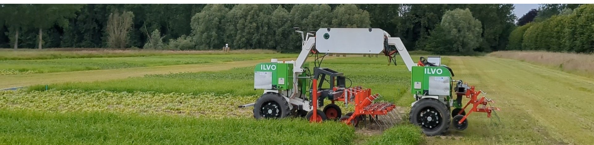

Welcome to ARTOF's documentation!
===================================

The **Agricultural Robot Taskmap Operation Framework (ARTOF)**
provides the common functionality of task map execution
for a wide range of robot configurations and farming applications
based on Global Navigation Satellite System (GNSS) positioning.

The robot supports the four-wheel-drive four-wheel-steer (4WD4WS), skid- and Ackerman steering vehicle configuration for different agricultural tasks in arable farming and horticulture.
The framework can be integrated on a robot platform during the development and construction or can be added with a customized after-market kit.
The ARTOF framework was integrated in several robots until now and is also used for steering guidance on an implement carrier.

.. note::

   This ARTOF project started in 2019 at `ILVO <https://ilvo.vlaanderen.be/en>`_ within the `European Interreg-Vlaanderen CIMAT <https://www.cimat.be/>`_ project and is still under active development to support in other EU projects.

ARTOF integrations
------------------
CIMAT robot
^^^^^^^^^^^
The CIMAT robot is an in-house-developed 4WD4WS robot used for crop care applications, e.g. hoeing, ridging and flame weeding, and soil pressure sampling.

|fig_cimat_flame_weeding| |fig_cimat_soil_compaction|
|fig_cimat_hoeing|

.. |fig_cimat_flame_weeding| image:: images/fig_cimat_flame_weeding.jpg
   :width: 45%
   :alt: Flame weeding in potatoes

.. |fig_cimat_soil_compaction| image:: images/fig_cimat_soil_compaction.jpg
   :width: 45%
   :alt: Soil compaction measurements

The main characteristics of the CIMAT robot are listed below.

+-----------------------+---------------------------------------------------------------+
|                                       **CIMAT robot**                                 |
+=======================+===============================================================+
| Vehicle configuration | 4WD4WS                                                        |
+-----------------------+---------------------------------------------------------------+
| Weight                | 1200 kg                                                       |
+-----------------------+---------------------------------------------------------------+
| Max velocity          | 15 km/h                                                       |
+-----------------------+---------------------------------------------------------------+
|                        **Energy source (LiFePO4 battery)**                            |
+-----------------------+---------------------------------------------------------------+
| Voltage               | 52 V                                                          |
+-----------------------+---------------------------------------------------------------+
| Capacity              | 20 kWh                                                        |
+-----------------------+---------------------------------------------------------------+
|                          **Transmission (electric)**                                  |
+-----------------------+---------------------------------------------------------------+
| Nominal power         | 4 x 6 kW                                                      |
+-----------------------+---------------------------------------------------------------+
| Gear ratio            | 40                                                            |
+-----------------------+---------------------------------------------------------------+
|                             **Steering (electric)**                                   |
+-----------------------+---------------------------------------------------------------+
| Nominal power (Steer) | 4 x 440 W                                                     |
+-----------------------+---------------------------------------------------------------+
| Gear ratio (Steer)    | 208                                                           |
+-----------------------+---------------------------------------------------------------+
|                                **Hydraulics**                                         |
+-----------------------+---------------------------------------------------------------+
| Nominal power         | 2.4 kW                                                        |
+-----------------------+---------------------------------------------------------------+
| RPM                   | 3000                                                          |
+-----------------------+---------------------------------------------------------------+
| Pump size             | 3cc                                                           |
+-----------------------+---------------------------------------------------------------+
|                             **Implement interface**                                   |
+-----------------------+---------------------------------------------------------------+
| Mounting              | Center three-point hitch cat.1, rear three-point hitch cat. 2 |
+-----------------------+---------------------------------------------------------------+
| Hydraulic couplers    | 3                                                             |
+-----------------------+---------------------------------------------------------------+
| Electric connectors   | 24V, 48V                                                      |
+-----------------------+---------------------------------------------------------------+

DjustE robot
^^^^^^^^^^^^
The DjustE is an in-house converted electrified hydrostatic compact tractor (CNH Boomer 50).
It can be used as a robot or as a tractor for different field operations requiring, for example a Power Take Off (PTO).

|fig_djuste_rotary_tillage_driving| |fig_djuste_rotary_tillage_turning|

.. |fig_djuste_rotary_tillage_driving| image:: images/fig_djuste_rotary_tillage_driving.jpg
   :width: 45%
   :alt: Rotarry tillage

.. |fig_djuste_rotary_tillage_turning| image:: images/fig_djuste_rotary_tillage_turning.jpg
   :width: 45%
   :alt: Headacre turn

The main characteristics of the DjustE robot are listed below.

+-----------------------+-------------------------------------------------------------------+
|                                      **Djuste robot**                                     |
+=======================+===================================================================+
| Vehicle configuration | Ackerman steering                                                 |
+-----------------------+-------------------------------------------------------------------+
| Weight                |  kg                                                               |
+-----------------------+-------------------------------------------------------------------+
| Max velocity          | 30 km/h                                                           |
+-----------------------+-------------------------------------------------------------------+
|                        **Energy source (LiFePO4 nose battery, lead acid front battery)**  |
+-----------------------+-------------------------------------------------------------------+
| Voltage               | 102 V, 92 V                                                       |
+-----------------------+-------------------------------------------------------------------+
| Capacity              | 6 kWh (nose battery), 13 kWh (front battery)                      |
+-----------------------+-------------------------------------------------------------------+
|                       **Transmission (electric/hydraulic)**                               |
+-----------------------+-------------------------------------------------------------------+
| Nominal power         | 27 kW                                                             |
+-----------------------+-------------------------------------------------------------------+
| Gear ratio            | Directly connected to the clutch plane                            |
+-----------------------+-------------------------------------------------------------------+
|                                **Hydraulics**                                             |
+-----------------------+-------------------------------------------------------------------+
| Nominal power         | 1.5 kW                                                            |
+-----------------------+-------------------------------------------------------------------+
| RPM                   | 1800-3000                                                         |
+-----------------------+-------------------------------------------------------------------+
| Pump size             | Dual 10cc pump for independent steering and hitch control         |
+-----------------------+-------------------------------------------------------------------+
|                             **Implement interface**                                       |
+-----------------------+-------------------------------------------------------------------+
| Mounting              | Rear three-point hitch cat. 2 (front hitch used for battery pack) |
+-----------------------+-------------------------------------------------------------------+
| Hydraulic couplers    | 2                                                                 |
+-----------------------+-------------------------------------------------------------------+
| Electric connectors   | 12V , 24V, 48V                                                    |
+-----------------------+-------------------------------------------------------------------+
| Power take off (PTO)  | 3 gears                                                           |
+-----------------------+-------------------------------------------------------------------+

Treebot robot
^^^^^^^^^^^^^
The Treebot robot is an in-house-developed robot to perform horticulture applications.

|fig_treebot_blueberry| |fig_treebot_lane_trees|

.. |fig_treebot_blueberry| image:: images/fig_treebot_blueberry.jpg
   :width: 45%
   :alt: Precision spray application on the black strip

.. |fig_treebot_lane_trees| image:: images/fig_treebot_lane_trees.jpg
   :width: 45%
   :alt: Platform upgraded in 2024

The main characteristics of the Treebot robot are listed below.

+-----------------------+-------------------------------------------------------------------+
|                                     **Treebot robot**                                     |
+=======================+===================================================================+
| Vehicle configuration | Track skid steering                                               |
+-----------------------+-------------------------------------------------------------------+
| Weight                | 80 kg                                                             |
+-----------------------+-------------------------------------------------------------------+
| Max velocity          | 3 km/h                                                            |
+-----------------------+-------------------------------------------------------------------+
|                        **Energy source (LiFePO4 battery)**                                |
+-----------------------+-------------------------------------------------------------------+
| Voltage               | 52 V                                                              |
+-----------------------+-------------------------------------------------------------------+
| Capacity              |  kWh                                                              |
+-----------------------+-------------------------------------------------------------------+
|                       **Transmission (electric)**                                         |
+-----------------------+-------------------------------------------------------------------+
| Nominal power         | 2x 400 W                                                          |
+-----------------------+-------------------------------------------------------------------+
| Gear ratio            | 100                                                               |
+-----------------------+-------------------------------------------------------------------+
|                             **Implement interface**                                       |
+-----------------------+-------------------------------------------------------------------+
| Mounting              | Item mounting plate                                               |
+-----------------------+-------------------------------------------------------------------+
| Electric connectors   | 24V, 48V                                                          |
+-----------------------+-------------------------------------------------------------------+

Implement carrier
^^^^^^^^^^^^^^^^^
The implement carrier is developed by the machine manufacturer `Lambers LMB <https://lambers-lmb.be/>`_ and is mainly used for seeding field trails.
The ARTOF framework was implemented as an after-market kit to support steering guidance while seeding.

|fig_lambers_seeding| |fig_lambers_static|

.. |fig_lambers_static| image:: images/fig_lambers_static.jpg
   :width: 45%
   :alt: Implemnet carrier platform

The main characteristics of the Implement carrier are listed below.

+-----------------------+-------------------------------------------------------------------+
|                         **Lambers implement carrier**                                     |
+=======================+===================================================================+
| Vehicle configuration | Ackerman steering                                                 |
+-----------------------+-------------------------------------------------------------------+
| Weight                |  kg                                                               |
+-----------------------+-------------------------------------------------------------------+
| Max velocity          | 7 km/h                                                            |
+-----------------------+-------------------------------------------------------------------+
|                        **Energy source (combustion engine)**                              |
+-----------------------+-------------------------------------------------------------------+
| Voltage               | gasoline                                                          |
+-----------------------+-------------------------------------------------------------------+
| Capacity              | 30 l tank                                                         |
+-----------------------+-------------------------------------------------------------------+
|                       **Transmission (electric/hydraulic)**                               |
+-----------------------+-------------------------------------------------------------------+
| Nominal power         | 27 kW                                                             |
+-----------------------+-------------------------------------------------------------------+
| Gear ratio            | Directly connected to the clutch plane                            |
+-----------------------+-------------------------------------------------------------------+
|                                **Hydraulics**                                             |
+-----------------------+-------------------------------------------------------------------+
| Nominal power         | 1.5 kW                                                            |
+-----------------------+-------------------------------------------------------------------+
| RPM                   | 1800-3000                                                         |
+-----------------------+-------------------------------------------------------------------+
| Pump size             | 4 cc                                                              |
+-----------------------+-------------------------------------------------------------------+
|                             **Implement interface**                                       |
+-----------------------+-------------------------------------------------------------------+
| Mounting              | 3x three-point hitch cat. 1                                       |
+-----------------------+-------------------------------------------------------------------+
| Electric connectors   | 12V (lead acid battery)                                           |
+-----------------------+-------------------------------------------------------------------+
| Power take off (PTO)  | powered by electro motor to actuate the seeding module            |
+-----------------------+-------------------------------------------------------------------+

Videos
------
To see these robots at work in different applications, checkout the youtube videos below:

|vid_field_robots_general| |vid_cimat_ridging| |vid_cimat_flame_weeding|

|vid_djuste_avs| |vid_djuste_construction|  |vid_treebot_precision_spraying|

.. |vid_field_robots_general| image:: https://img.youtube.com/vi/JEKxRF19jJs/0.jpg
   :width: 30%
   :alt: Axel Willekens on the ILVO field robots 2023
   :target: https://www.youtube.com/watch?v=JEKxRF19jJs

.. |vid_cimat_ridging| image:: images/fig_cimat_ridging_thumbnail.jpg
   :width: 30%
   :alt: Ridging in leek with the CIMAT robot
   :target: https://www.youtube.com/watch?v=kYXqshhpFiM&t

.. |vid_cimat_flame_weeding| image:: https://img.youtube.com/vi/2mEPxm51ICk/0.jpg
   :width: 30%
   :alt: Self-driving robot with flame weeder
   :target: https://www.youtube.com/watch?v=2mEPxm51ICk

.. |vid_djuste_avs| image:: https://img.youtube.com/vi/q0XQCb_Gn4Y/0.jpg
   :width: 30%
   :alt: Autonomous tractor at ILVO
   :target: https://www.youtube.com/watch?v=q0XQCb_Gn4Y

.. |vid_djuste_construction| image:: https://img.youtube.com/vi/_6-2Ud9xHFI/0.jpg
   :width: 30%
   :alt: Autonomous tractor at ILVO
   :target: https://www.youtube.com/watch?v=_6-2Ud9xHFI

.. |vid_treebot_precision_spraying| image:: https://img.youtube.com/vi/Ujj8gkYzaAs/0.jpg
   :width: 30%
   :alt: Alternative weed control in blue berries with a small scale robot and precision sprayer
   :target: https://www.youtube.com/watch?v=Ujj8gkYzaAs

Scientific publications
-----------------------

Contents
--------

.. toctree::

   architecture
   configuration
   mechatronic-layer
   operational-layer
   addons
   installation
   usage
   license
