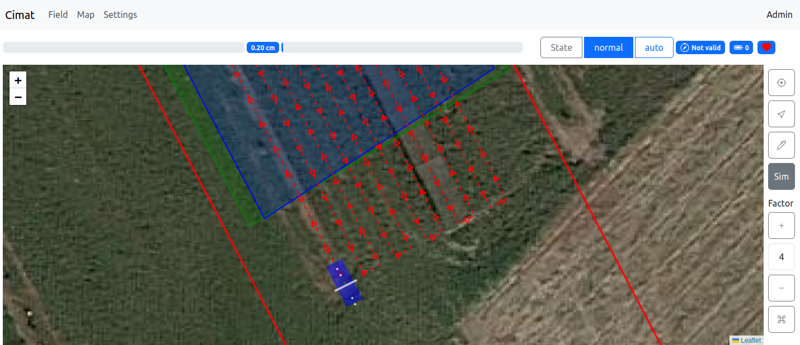

Installation
============

Install Docker
--------------

For both installations you need to have docker installed.
Install `docker <https://docs.docker.com/engine/install/ubuntu/>`_ with `root-level privileges <https://docs.docker.com/engine/install/linux-postinstall/>`_.
You may have to reboot after installation.

A full :ref:`installation_docker` installation can be used for testing or developing the framework.
A :ref:`installation_system` installation is preferred when integrating the framework on a robot platform.

.. _installation_docker:

Docker
------

1. Download the file below and unzip.

+ On **linux** you can use ``wget`` command to download the file:

.. code-block:: bash

	wget https://minio.ilvo.be:9000/tv115-ilvo-robotics/artof-docker.zip


+ On **windows** and **macOS** you can use ``curl`` command to download the file:

.. code-block:: bash

	curl -o artof-docker.zip https://minio.ilvo.be:9000/tv115-ilvo-robotics/artof-docker.zip

2. Unzip the folder and navigate into the folder ``ilvo``.

+ On **linux** and **macOS** you can use unzip:

.. code-block:: bash

	unzip artof-docker.zip
	cd ilvo

+ On **windows** you can right click on the zip file and unzip it.

3. Open the ``data/redis.init.json`` file and change ``/d/artof-docker/docker/data`` to the absolute path of the datafolder in this directory. Note that for windows the ``D:`` drive has to be referred to as ``/d/``.

4. Start the containers by executing the ``docker compose up`` command. You will see the output of the ``artof-core`` and ``redis-stack-server`` containers.
The first time, it can take some time for the ``artof-core`` to pull and install the system and node-red add-on.
The output of the ``artof-core`` will provide information of how the add-ons are launching.
You can check the status of the different containers in docker Docker or using the Docker cli.

+ *Note*: When updating to a new version, it is important to clear the redis cache. This can be done by removing the ``redis_data`` volume or perform the ``redis-cli FLUSHALL`` command.

The Docker installation is tested on:

+-----------------------+-----------+---------------------------+
| Operating System      | Arch      | Docker Version            |
+=======================+===========+===========================+
| Ubuntu 22.04          | x86_64    | 26.0.0, build 2ae903e     |
+-----------------------+-----------+---------------------------+
| Windows 11            | x86_64    | 26.0.0, build 2ae903e     |
+-----------------------+-----------+---------------------------+
| Windows 10            | x86_64    | 26.0.0, build 2ae903e     |
+-----------------------+-----------+---------------------------+
| macOS Sonoma 14.2     | x86_64    | 26.0.0, build 2ae903e     |
+-----------------------+-----------+---------------------------+

.. _installation_system:

System
------

1. Download and run the script to install the ARTOF dependencies.

.. code-block:: bash

	wget https://minio.ilvo.be:9000/tv115-ilvo-robotics/install.sh
	chmod +x install.sh
	./install.sh


2. The update script can be used for installing the ARTOF binaries for the first time, but also to update to a later or specific version.

For the installation perform the bash commands below and wait until ```Done!``` appears.

.. code-block:: bash

	wget https://minio.ilvo.be:9000/tv115-ilvo-robotics/update.sh
	chmod +x install.sh
	./update.sh

For updating to the latest version perform the bash commands below and wait until ```Done!``` appears.

.. code-block:: bash

	./update.sh

The binary installation is currently only supported on **Ubuntu 22.04 (arch: x86_64)**.

The binary installation is tested on:

+-----------------------+-----------+---------------------------+
| Operating System      | Arch      | Docker Version            |
+=======================+===========+===========================+
| Ubuntu 22.04          | x86_64    | 26.0.0, build 2ae903e     |
+-----------------------+-----------+---------------------------+

Check your installation (Binary and Docker)
-------------------------------------------

Now, you can browse for the first time to the *system add-on web page*.

+ For the system installation, browse to `http://<ip-robot> <http://localhost>`_.

+ For the docker installation, browse to `http://<ip-robot>:8080 <http://localhost:8080>`_.

Next, browse to the *Tab Map* and toggle the ```Sim``` button twice. You should see the robot appear as shown in *Figure 1*.



	**Figure 1.** Tab Map: First view of the robot in the system add-on


Thereafter, check the *node-red add-on* installation at `http://<ip-robot>:1880 <http://localhost:1880>`_.

Additional hardware configuration
---------------------------------

SimpleRTK3b GPS
^^^^^^^^^^^^^^^

1. Connect to USB ethernet (dhcp) and write the ip `192.168.3.1 <http://192.168.3.1>`_ in your brower.

2. In tab ```Corrections``` ```Correntions Input```, set ```USB1``` to ```RTCMv3```

3. In tab ```NMEA/SBF Out``` add ```New NMEA stream``` set ```USB1``` to ```GGA+VTG+HDT+HRP``` and specify your interval.

4. On your computer you need to add yourself to the dialout group ```sudo usermod -a -G dialout <your-username>``` and reboot.

5. Configure automatic hyperlink creation for a ```/dev/ttACMx``` to ```/dev/septentrio0```. Therefore paste the following in the file ```/etc/udev/rules.d/99-septentrio.rules```:

.. code-block:: bash

	sudo vim /etc/udev/rules.d/99-septentrio.rules

.. code-block:: bash

	# SEPTENTRIO (names are not loaded in lsusb, use ENV variables of udevadm)
	SUBSYSTEM=="tty", ACTION=="add", ENV{ID_VENDOR_ID}=="152a", ENV{ID_MODEL_ID}=="85c0", ENV{ID_USB_INTERFACE_NUM}=="02", SYMLINK+="septentrio0"
	SUBSYSTEM=="tty", ACTION=="add", ENV{ID_VENDOR_ID}=="152a", ENV{ID_MODEL_ID}=="85c0", ENV{ID_USB_INTERFACE_NUM}=="04", SYMLINK+="septentrio1"


Enable ssh
^^^^^^^^^^

To enable ssh execute the following commands:

.. code-block::

	sudo apt update
	sudo apt install openssh-server -y
	sudo systemctl status ssh

Remote connection
^^^^^^^^^^^^^^^^^

To access the robot framework remotely, you can configure a VPN connection (e.g. `tailscale <https://tailscale.com/kb/1031/install-linux>`_).


Common issues
-------------

Ethernet over USB of the SimpleRTK3b module on a NUC
^^^^^^^^^^^^^^^^^^^^^^^^^^^^^^^^^^^^^^^^^^^^^^^^^^^^

The Septentrio chip of the SimpleRTK3b GPS modules provides ethernet over USB. This can cause problems on boot time as this USB network device may be selected in favor of the PCI network device. This guide provides a step-by-step approach to create a `systemd` service file that ensures the specified PCI network device is automatically connected at boot time using `nmcli`. The provided instructions use `systemd`, a system and service manager for Linux operating systems, to execute the NetworkManager command line interface (```nmcli```) once the network is online.

1. Open a Terminal: ```Cntrl-Alt-t```

2. Create Service File: Use a text editor with root permissions to create a new systemd service file. You can use ```nano``` or ```vim``` or any other text editor.


.. code-block:: bash

	sudo vim /etc/systemd/system/connect-network.service


3. Add Service Configuration: Copy the following content into the newly created service file. Replace `<network device>` with the network device identifier you intend to connect.

.. code-block:: ini

	[Unit]
	Description=Connect to a specific network device at boot
	After=network-online.target
	Wants=network-online.target

	[Service]
	Type=oneshot
	ExecStart=/usr/bin/nmcli dev connect <network device>
	RemainAfterExit=yes

	[Install]
	WantedBy=multi-user.target


4. Enable and start the service

.. code-block:: bash

	sudo systemctl enable connect-network.service
	sudo systemctl start connect-network.service

