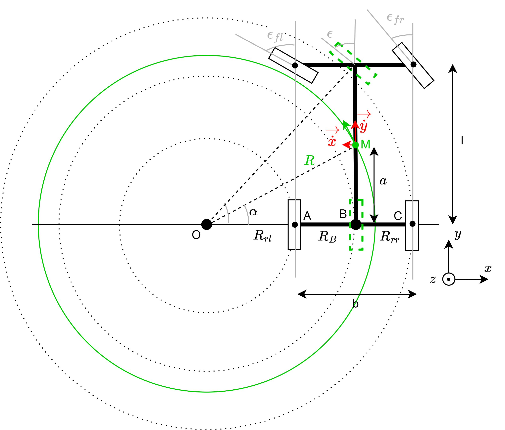

Mechatronic layer
=================

Introduction
------------

The mechatronic layer requires a custom implementation.
It depends on the vehicle configuration, the selected components and the safety concept for the platform.

Requirements
------------

The ARTOF framework can be integrated after-marked or during the development of a new robot platform.

The minimal hardware requirements to perform steering guidance are:

#. **Safety** the implementation of the mechatronic layer is responsible for all the safety features of the platform in accordance to the national legislation.
#. **Programmable Logic Controller** A PLC interacts with all the actuators and sensors on the platform. The functionality that needs to be implemented are:

   + Execution of the *inverse and direct kinematic model* and operates the steering and driving actuators accordingly.
   + Example components: Siemens S7-1200 and Siemens S7-1500 series

#. **Steering angle control**: The steering angle needs to be controlled by the PLC.

   + For *hydraulic steering* this was done using a hydraulic steering block.
   + For *electric steering* this was done by controlling the motor drive.
   + *Example components*: `Raven RS1 <https://nl.ravenind.com/ag-products/guidance/rs1>`_

#. **Steering angle feedback**: The steering angle needs to be monitored by the PLC to enable closed-loop steering control.

   + For *Ackerman steering* robots this was done with an inductive angle sensor on the steering rack.
   + For *4WD4WS steering* robots all wheel angles need to be measured. This was also done using inductive angle sensors.
   + *Example components*: `Multiprox RI360P1-QR20-LU4X2-H1141 <https://www.turck.nl/nl/product/100000186>`_

#. **Velocity control**: The driving velocity needs to be controlled by the PLC.

   + For *hydraulic traction* this was done by controlling the swash plate by an electric actuator.
   + For *electric traction* this was done by setting the motor drives in velocity control.
   + For robots also enabling paddle velocity control for the driver an electronic analogue paddle was used.

#. **Velocity feedback**: The driving velocity needs to be monitored by the PLC to enable closed-loop velocity control.

   + For robots with *hydraulic transmission* this was done by a rotary encoder and two interlocking cogs.
   + For robots with *electrical transmission* this was done by reading in the hall-sensor, sin/cos encoder, etc.

Additional requirements to operate a robot platform:

#. **Hitch control**: The hitches need to be controlled by the PLC.

   + For *hydraulic hitches* this was done using electric valves.

#. **Hitch angle feedback**: The hitch angles need to be monitored by the PLC to enable closed-loop hitch height control.

   + *Example components*: `Multiprox RI360P1-QR20-LU4X2-H1141 <https://www.turck.nl/nl/product/100000186>`_

.. note::

   All safety measures must be implemented within the mechatronic layer in accordance with national legislation.
   The operational layer does not include any safety features and should only be used on products that are CE marked for autonomous operation.

Safety state diagram
--------------------

For more information on the safety state diagram, we refer to the paper *<Coming soon>*.

Kinematic model
---------------

Introduction
^^^^^^^^^^^^

.. note::

   Abbreviation used:

      #. longitude (lng), latitude (lat)
      #. front (f), rear (r), so fr (front-right)
      #. angular velocity (:math:`\omega`), steering angle (:math:`\epsilon`)

The *direct kinematic model* describes the platform's motion by the velocity vector :math:`\vec{V}_r = (v_{lng}, v_{lat}, \omega_z)` based on the actuators feedback e.g. :math:`\omega_{wheel,rr}`, :math:`\omega_{wheel,rl}`, :math:`\epsilon_{f}`, :math:`\epsilon_{fl}`, depending on the vehicle configuration.

The *inverse kinematic model* does the opposite and starts from the required motion or velocity vector :math:`\vec{V}_r = (v_{lng}, v_{lat}, \omega_z)` to calculate the position or velocities of the actuators.

Kinematic means no external forces are incorporated in this model to come to this motion. A model where the external forces are incorporated is called a dynamic model.

The kinematic model is integrated on the mechatronic layer. In this way the operational layer is independent of the vehicle configuration.
An essential part of the *mechatronic-operational layer interface* is the velocity vector :math:`\vec{V}_r = (v_{lng}, v_{lat}, \omega_z)`, which are described in the Redis variables ``plc.control.navigation.velocity.longitudinal``,  ``plc.control.navigation.velocity.lateral``, ``plc.control.navigation.velocity.angular``.

Much information related to vehicle *kinematics* and *dynamics* can be found in the book Vehicle dynamics of Reza N. Nazar.

.. code-block::

   Jazar, R. N. (2008). Vehicle dynamics (Vol. 1). Berlin/Heidelberg,
   Germany: Springer.

Four-wheel-drive four-wheel-steer (4WD4WS)
^^^^^^^^^^^^^^^^^^^^^^^^^^^^^^^^^^^^^^^^^^

Figure 1. was used to derive the kinematic model of a four-wheel-drive, four-wheel-steer (4WD4WS) robot.

.. figure:: images/fig_kinematics_4ws4wd.png
   :width: 70%
   :align: center

   Figure 1. Kinematics 4WD4WS vehicle configuration

For the *direct kinematic model*

.. math::
   f(v_{fl}, v_{fr}, v_{rl}, v_{rr}, \epsilon_{fl}, \epsilon_{fr}, \epsilon_{rl}, \epsilon_{rr}) = (v_x, v_y, \omega_z)

the following formulas can be extracted using Figure 1.

.. math::
    v_{fl} &= R_{w} \cdot \omega_{w,fl} \\
    v_{fr} &= R_{w} \cdot \omega_{w,fr} \\
    v_{rl} &= R_{w} \cdot \omega_{w,rl} \\
    v_{rr} &= R_{w} \cdot \omega_{w,rr} \\
    v_{y} &= \frac{1}{4} \left[ v_{fl} \cdot cos(\epsilon_{fl}) + v_{fr} \cdot cos(\epsilon_{fr}) + v_{rl} \cdot cos(\epsilon_{rl}) + v_{rr} \cdot cos(\epsilon_{rr}) \right] \\
    v_{x} &= \frac{1}{4} \left[ v_{fl} \cdot sin(\epsilon_{fl}) + v_{fr} \cdot sin(\epsilon_{fr}) + v_{rl} \cdot sin(\epsilon_{rl}) + v_{rr} \cdot sin(\epsilon_{rr}) \right] \\
    \omega_{z} & =  \frac{l}{2}  \left( \left[ v_{rl} \cdot sin(\epsilon_{rl}) + v_{rr} \cdot sin(\epsilon_{rr}) \right] - \left[  v_{fl} \cdot sin(\epsilon_{fl}) + v_{fr} \cdot sin(\epsilon_{fr})  \right] \right)

The *inverse kinematic model*

.. math::
   g(v_x, v_y, \omega_z) = (v_{fl}, v_{fr}, v_{rl}, v_{rr}, \epsilon_{fl}, \epsilon_{fr}, \epsilon_{rl}, \epsilon_{rr})

First, the points :math:`\mathrm{A}` up to :math:`\mathrm{F}` indicated in Figure 1., :math:`\mathrm{R}_{xx}` were determined.

.. math::
    &\left|\mathrm{AE}\right| = \left|\mathrm{BF}\right| = \frac{\mathrm{l}}{2} + \mathrm{R} \sin(\gamma) \\
    &\left|\mathrm{EC}\right| = \left|\mathrm{FD}\right| = \frac{\mathrm{l}}{2} - \mathrm{R} \sin(\gamma) \\
    &\left|\mathrm{OE}\right| = \mathrm{R} \cos(\gamma) - \frac{\mathrm{b}}{2} \\
    &\left|\mathrm{OF}\right| = \mathrm{R} \cos(\gamma) + \frac{\mathrm{b}}{2} \\
    &\mathrm{R}_{fl} = \left(\left|\mathrm{AE}\right|^2 + \left|\mathrm{OE}\right|^2 \right)^{\frac{1}{2}} \\
    &\mathrm{R}_{fr} = \left(\left|\mathrm{OF}\right|^2 + \left|\mathrm{BF}\right|^2 \right)^{\frac{1}{2}} \\
    &\mathrm{R}_{rl} = \left(\left|\mathrm{OE}\right|^2 + \left|\mathrm{EC}\right|^2 \right)^{\frac{1}{2}} \\
    &\mathrm{R}_{rr} = \left(\left|\mathrm{OF}\right|^2 + \left|\mathrm{FD}\right|^2 \right)^{\frac{1}{2}}

Also we know:

.. math::
   &\mathrm{\Delta v}_f = \big| (\mathrm{R}_{fl}  -  \mathrm{R}_{fr}) \cdot \dot{\mathrm{\theta}}  \big| \nonumber\\
   &\mathrm{\Delta v}_r = \big| (\mathrm{R}_{rl}  -  \mathrm{R}_{rr}) \cdot \dot{\mathrm{\theta}}  \big|

Using the radius :math:`\mathrm{R}_{xx}` given the equations above, :math:`\omega_{w,xx}` and :math:`\epsilon_{xx}` were calculated.

.. math::
   & \mathrm{\omega}_{w,fl} = \mathrm{sgn}(\dot{\mathrm{y}})\cdot \big(- \mathrm{sgn}(\dot{\mathrm{\theta}})\,\frac{\mathrm{\Delta v}_f}{2} + v\big) \cdot \frac{2}{\mathrm{D}_w}\\
   & \mathrm{\omega}_{w,fr} = \mathrm{sgn}(\dot{\mathrm{y}})\cdot \big( \mathrm{sgn}(\dot{\mathrm{\theta}})\,\frac{\mathrm{\Delta v}_f}{2} + v \big) \cdot \frac{2}{\mathrm{D}_w}\\
   & \mathrm{\omega}_{w,rl} = \mathrm{sgn}(\dot{\mathrm{y}})\cdot \big(- \mathrm{sgn}(\dot{\mathrm{\theta}})\,\frac{\mathrm{\Delta v}_r}{2} + v \big) \cdot \frac{2}{\mathrm{D}_w}\\
   & \mathrm{\omega}_{w,rr} = \mathrm{sgn}(\dot{\mathrm{y}})\cdot \big( \mathrm{sgn}(\dot{\mathrm{\theta}})\,\frac{\mathrm{\Delta v}_r}{2} + v \big) \cdot \frac{2}{\mathrm{D}_w} \\
   & \mathrm{\epsilon}_{fl} = \arctan \left( \frac{\left|\mathrm{AE}\right|}{\left|\mathrm{OE}\right|} \right) \\
   & \mathrm{\epsilon}_{fr} = \arctan \left( \frac{\left|\mathrm{BF}\right|}{\left|\mathrm{OF}\right|} \right) \\
   & \mathrm{\epsilon}_{rl} = \arctan \left( - \frac{\left|\mathrm{EC}\right|}{\left|\mathrm{OE}\right|} \right) \\
   & \mathrm{\epsilon}_{rr} = \arctan \left( - \frac{\left|\mathrm{FD}\right|}{\left|\mathrm{OF}\right|} \right)

Ackerman steering
^^^^^^^^^^^^^^^^^

Most of the information in this section comes from the book Vehicle dynamics from Reza N. Jazar (2008).

Ackerman steering is a simplified version of a 4WD4WS robot.
The ICR moves the centre of mass M in Figure 2.
Consequently, points E and F coincide with points C and D, and :math:`\left|\mathrm{EC}\right| = \left|\mathrm{FD}\right| = 0` equation :math:`\epsilon_{rr} = \epsilon_{rl} = 0` apply.

   Figure 2. Kinematics Ackerman vehicle configuration, with M the center of mass.

To derive the Ackerman steering kinematics, the bicycle model is used. This is represented in Figure 2. by the dash green lines.
Thereby applies :math:`cot(\epsilon) = \frac{cot(\epsilon_{fl}) + cot(\epsilon_{fr})}{2}` and  :math:`R = \sqrt{a^2 + l^2\, cot^2(\epsilon)}`.

Assume for this example that only the front-right steering angle and velocity of the rear-left wheel was measured.

The *direct kinematic model*

.. math::
   f(v_{rl}, \epsilon_{fr}) = (v_x, v_y, \omega_z)

.. math::
   v_{rl} &= R_{w} \cdot \omega_{w,rl} \\
   v_{y} &= \frac{R\,cos(\epsilon)}{R\,cos(\epsilon) - (b/2)}  \cdot v_{rl}\\
   v_{x} &= v_{y} \cdot tan(\epsilon) \\
   v &= \sqrt{v^2_x + v^2_y} \\
   \omega_{z} & =  \frac{v}{R}

The *inverse kinematic model*

.. math::
   g(v, \omega_z) = (v_{rl}, \epsilon_{fr})

Using formulas:

.. math::
   v &= \sqrt{v^2_x + v^2_y} \\
   v &= \omega_z \, R \\
   R &= \sqrt{a^2 + l^2\, cot^2(\epsilon)} \\
   cot(\epsilon) &= \frac{cot(\epsilon_{fl}) + cot(\epsilon_{fr})}{2} \\

We can calculate:

.. math::
   \epsilon &= acot\bigg(\sqrt{\frac{\frac{v^2}{\omega^2_z} - a^2}{l^2}}\bigg) \\
   \epsilon_{fr} &= acot(2\cdot cot(\epsilon) - cot(\epsilon_{fl})) \\
   v_{rl} &= \frac{R\,cos(\epsilon) - (b/2)}{R\,cos(\epsilon)} \cdot v \, cos(\epsilon)