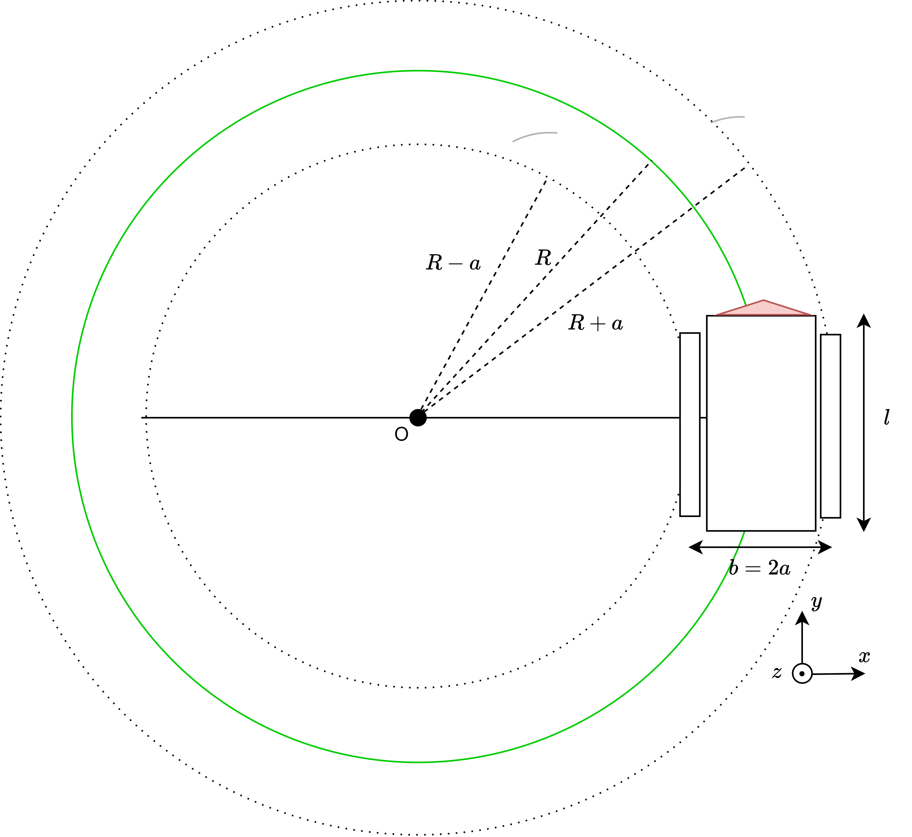

Mechatronic layer
=================

Introduction
------------

The ARTOF framework is ideally integrated during the development of a new robot platform, but can also be integrated afterwards.
The mechatronic layer requires a custom implementation tailored to the specific vehicle configuration, selected components, and the platform's safety requirements.

Requirements
------------

The minimal hardware requirements to perform steering guidance are:

#. **Safety**: The implementation of the mechatronic layer is responsible for all the platform's safety features in accordance with national legislation. This implementation is machine dependent and is not provided by the ARTOF framework.
#. **Programmable Logic Controller**: A PLC interfaces with all the actuators and sensors on the platform. At a minimum, it must implement the inverse and direct kinematic models to ensure correct control of the steering and driving actuators.

   + *Example components*: Siemens S7-1200 and Siemens S7-1500 series

#. **Steering angle control**: The steering angle needs to be controlled by the PLC.

   + For *hydraulic steering*, this can be done using a hydraulic steering block.
   + For *electric steering*, this can be done by controlling the motor drive.
   + *Example components*: `Raven® RS1 <https://nl.ravenind.com/ag-products/guidance/rs1>`_

#. **Steering angle feedback**: The PLC needs to monitor the steering angle to enable closed-loop steering control.

   + For *Ackerman steering* robots, this can be done with an inductive angle sensor on the steering rack.
   + For *4WD4WS steering* robots, all the wheel angles need to be measured, which can also done using inductive angle sensors.
   + *Example components*: `Multiprox® RI360P1-QR20-LU4X2-H1141 <https://www.turck.nl/nl/product/100000186>`_

#. **Velocity control**: The driving velocity needs to be controlled by the PLC.

   + For *hydraulic traction*, this can be done by controlling the swash plate with an electric actuator.
   + For *electric traction*, this can be done by setting the motor drives to velocity control.
   + An electronic analogue paddle can be used for robots that enabled paddle velocity control for the driver.

#. **Velocity feedback**: The PLC needs to monitor the driving velocity to enable closed-loop velocity control.

   + For robots with *hydraulic transmission*, this can be done by a rotary encoder and two interlocking cogs.
   + For robots with *electrical transmission*, this can be done by reading the hall sensor, sin/cos encoder, etc.

Additional requirements to operate a robot platform:

#. **Hitch control**: The hitches need to be controlled by the PLC.

   + For *hydraulic hitches* this can be done using electric valves.

#. **Hitch angle feedback**: The PLC needs to monitor the hitch angles to enable closed-loop hitch height control.

   + If no actuator feedback is available, this can be done using inductive angle sensors.
   + *Example components*: `Multiprox RI360P1-QR20-LU4X2-H1141 <https://www.turck.nl/nl/product/100000186>`_

.. note::

   All safety measures must be implemented within the mechatronic layer.
   The operational layer does not include safety features and should only be used on products approved for autonomous operation in accordance with national legislation.

Safety state diagram
--------------------

For more information on the safety state diagram, we refer to the paper *<Coming soon>*.

Kinematic model
---------------

Introduction
^^^^^^^^^^^^

.. note::

   Abbreviation used:

      #. longitude (lng), latitude (lat)
      #. front (f), rear (r), so fr (front-right)
      #. angular velocity (:math:`\omega`), steering angle (:math:`\epsilon`)

The *direct kinematic model* describes the actual platform's motion by the velocity vector :math:`\boldsymbol{v_a} = (v_x, v_y, \omega_z)` based on the actuators feedback e.g. :math:`\omega_{wheel,rr}`, :math:`\omega_{wheel,rl}`, :math:`\epsilon_{f}`, :math:`\epsilon_{fl}`, etc., depending on the vehicle configuration.

The *inverse kinematic model* does the opposite and starts from the required motion or velocity vector :math:`\boldsymbol{v_r} = (v_{lng}, v_{lat}, \omega_z)` to calculate the position or velocities of the actuators.

Kinematic means no external forces are incorporated in this model to come to this motion. A model where the external forces are incorporated is called a dynamic model.

The kinematic model is integrated into the mechatronic layer, making the operational layer independent of the vehicle configuration.
An essential part of the *mechatronic-operational layer interface* is the infterface with the actual and required velocity vector.

+ The interface with the actual velocity vector :math:`\boldsymbol{v_a}` is described in the Redis variables ``plc.monitor.navigation.velocity.longitudinal``,  ``plc.monitor.navigation.velocity.lateral``, ``plc.monitor.navigation.velocity.angular``.

+ The interface with the required velocity vector :math:`\boldsymbol{v_r}` is described in the Redis variables ``plc.control.navigation.velocity.longitudinal``,  ``plc.control.navigation.velocity.lateral``, ``plc.control.navigation.velocity.angular``.

The book Vehicle Dynamics by Reza N. Nazar contains much information about *vehicle kinematics and dynamics*.

.. code-block::

   Jazar, R. N. (2008). Vehicle dynamics (Vol. 1). Berlin/Heidelberg,
   Germany: Springer.

Four-wheel-drive four-wheel-steer (4WD4WS)
^^^^^^^^^^^^^^^^^^^^^^^^^^^^^^^^^^^^^^^^^^

Figure 1 was used to derive the kinematic model of a four-wheel-drive, four-wheel-steer (4WD4WS) robot.

.. figure:: images/fig_kinematics_4ws4wd.png
   :width: 70%
   :align: center

   **Figure 1.** Kinematics 4WD4WS vehicle configuration

For the *direct kinematic model*

.. math::
   f(v_{fl}, v_{fr}, v_{rl}, v_{rr}, \epsilon_{fl}, \epsilon_{fr}, \epsilon_{rl}, \epsilon_{rr}) = (v_x, v_y, \omega_z)

The following formulas can be extracted using *Figure 1*.

.. math::
    v_{fl} &= R_{w} \cdot \omega_{w,fl} \\
    v_{fr} &= R_{w} \cdot \omega_{w,fr} \\
    v_{rl} &= R_{w} \cdot \omega_{w,rl} \\
    v_{rr} &= R_{w} \cdot \omega_{w,rr} \\
    v_{y} &= \frac{1}{4} \left[ v_{fl} \cdot cos(\epsilon_{fl}) + v_{fr} \cdot cos(\epsilon_{fr}) + v_{rl} \cdot cos(\epsilon_{rl}) + v_{rr} \cdot cos(\epsilon_{rr}) \right] \\
    v_{x} &= \frac{1}{4} \left[ v_{fl} \cdot sin(\epsilon_{fl}) + v_{fr} \cdot sin(\epsilon_{fr}) + v_{rl} \cdot sin(\epsilon_{rl}) + v_{rr} \cdot sin(\epsilon_{rr}) \right] \\
    \omega_{z} & =  \frac{l}{2}  \left( \left[ v_{rl} \cdot sin(\epsilon_{rl}) + v_{rr} \cdot sin(\epsilon_{rr}) \right] - \left[  v_{fl} \cdot sin(\epsilon_{fl}) + v_{fr} \cdot sin(\epsilon_{fr})  \right] \right)

The *inverse kinematic model*

.. math::
   g(v_x, v_y, \omega_z) = (v_{fl}, v_{fr}, v_{rl}, v_{rr}, \epsilon_{fl}, \epsilon_{fr}, \epsilon_{rl}, \epsilon_{rr})

First, the points :math:`\mathrm{A}` up to :math:`\mathrm{F}` indicated in *Figure 1*, :math:`\mathrm{R}_{xx}` were determined.

.. math::
    &\left|\mathrm{AE}\right| = \left|\mathrm{BF}\right| = \frac{\mathrm{l}}{2} + \mathrm{R} \sin(\gamma) \\
    &\left|\mathrm{EC}\right| = \left|\mathrm{FD}\right| = \frac{\mathrm{l}}{2} - \mathrm{R} \sin(\gamma) \\
    &\left|\mathrm{OE}\right| = \mathrm{R} \cos(\gamma) - \frac{\mathrm{b}}{2} \\
    &\left|\mathrm{OF}\right| = \mathrm{R} \cos(\gamma) + \frac{\mathrm{b}}{2} \\
    &\mathrm{R}_{fl} = \left(\left|\mathrm{AE}\right|^2 + \left|\mathrm{OE}\right|^2 \right)^{\frac{1}{2}} \\
    &\mathrm{R}_{fr} = \left(\left|\mathrm{OF}\right|^2 + \left|\mathrm{BF}\right|^2 \right)^{\frac{1}{2}} \\
    &\mathrm{R}_{rl} = \left(\left|\mathrm{OE}\right|^2 + \left|\mathrm{EC}\right|^2 \right)^{\frac{1}{2}} \\
    &\mathrm{R}_{rr} = \left(\left|\mathrm{OF}\right|^2 + \left|\mathrm{FD}\right|^2 \right)^{\frac{1}{2}}

Also, we know:

.. math::
   &\mathrm{\Delta v}_f = \big| (\mathrm{R}_{fl}  -  \mathrm{R}_{fr}) \cdot \dot{\mathrm{\theta}}  \big| \\
   &\mathrm{\Delta v}_r = \big| (\mathrm{R}_{rl}  -  \mathrm{R}_{rr}) \cdot \dot{\mathrm{\theta}}  \big|

Using the radius :math:`\mathrm{R}_{xx}` given the equations above, :math:`\omega_{w,xx}` and :math:`\epsilon_{xx}` were calculated.

.. math::
   & \mathrm{\omega}_{w,fl} = \mathrm{sgn}(\dot{\mathrm{y}})\cdot \big(- \mathrm{sgn}(\dot{\mathrm{\theta}})\,\frac{\mathrm{\Delta v}_f}{2} + v\big) \cdot \frac{2}{\mathrm{D}_w}\\
   & \mathrm{\omega}_{w,fr} = \mathrm{sgn}(\dot{\mathrm{y}})\cdot \big( \mathrm{sgn}(\dot{\mathrm{\theta}})\,\frac{\mathrm{\Delta v}_f}{2} + v \big) \cdot \frac{2}{\mathrm{D}_w}\\
   & \mathrm{\omega}_{w,rl} = \mathrm{sgn}(\dot{\mathrm{y}})\cdot \big(- \mathrm{sgn}(\dot{\mathrm{\theta}})\,\frac{\mathrm{\Delta v}_r}{2} + v \big) \cdot \frac{2}{\mathrm{D}_w}\\
   & \mathrm{\omega}_{w,rr} = \mathrm{sgn}(\dot{\mathrm{y}})\cdot \big( \mathrm{sgn}(\dot{\mathrm{\theta}})\,\frac{\mathrm{\Delta v}_r}{2} + v \big) \cdot \frac{2}{\mathrm{D}_w} \\
   & \mathrm{\epsilon}_{fl} = \arctan \left( \frac{\left|\mathrm{AE}\right|}{\left|\mathrm{OE}\right|} \right) \\
   & \mathrm{\epsilon}_{fr} = \arctan \left( \frac{\left|\mathrm{BF}\right|}{\left|\mathrm{OF}\right|} \right) \\
   & \mathrm{\epsilon}_{rl} = \arctan \left( - \frac{\left|\mathrm{EC}\right|}{\left|\mathrm{OE}\right|} \right) \\
   & \mathrm{\epsilon}_{rr} = \arctan \left( - \frac{\left|\mathrm{FD}\right|}{\left|\mathrm{OF}\right|} \right)

Ackerman steering
^^^^^^^^^^^^^^^^^

**Figure 2** is used to derive the kinematic model of an Ackerman vehicle.

.. figure:: images/fig_kinematics_ackerman.png
   :width: 70%
   :align: center

   **Figure 2.** Kinematics Ackerman vehicle configuration, with M as the center of mass.

The four-wheel vehicle model can be reduced to the bicycle model, indicated by the green dot lines in *Figure 2*.
The mass centre (M) will turn on the green circle around the Instanious Center of Rotation (ICR) (point O in *Figure 2*) with the radius in :ref:`Equation 1 <eq:kinematics_ackerman_radius>`.

.. math:: R = \sqrt{a^2 + l^2 \, \mathrm{cot}^2(\epsilon)}
   :name: eq:kinematics_ackerman_radius

The cot-average :ref:`Equation 2 <eq:kinematics_ackerman_cot_avg>` and the Ackerman condition in :ref:`Equation 3 <eq:kinematics_ackerman_condition>` apply in the geometry of the steering rack.

.. math:: \mathrm{cot}(\epsilon) = \frac{\mathrm{cot}(\epsilon_{fl}) + \mathrm{cot}(\epsilon_{fr})}{2}
   :name: eq:kinematics_ackerman_cot_avg

.. math:: \frac{b}{l} = \mathrm{cot}(\epsilon_{fr}) - \mathrm{cot}(\epsilon_{fl})
   :name: eq:kinematics_ackerman_condition

In *Figure 2* we can see that the Equations :math:`\mathrm{tan}(\epsilon) = \frac{l}{R_B}` and :math:`\mathrm{tan}(\alpha) = \frac{a}{R_B}` apply.
We can calculate :math:`\alpha` in :ref:`Equation 4 <eq:kinematics_ackerman_alpha>`.

.. math:: \alpha = \mathrm{atan} \big(\frac{a}{l}\, \mathrm{tan}(\epsilon) \big)
    :name: eq:kinematics_ackerman_alpha

Assume that we only measure the front-left steering angle :math:`\epsilon_{fl}` and the angular velocity of the rear-right wheel :math:`\epsilon_{rr}`.
For small angles in :math:`\epsilon`, we can assume :math:`\omega_A = \omega_B = \omega_C`. Consequently :ref:`Equation 5 <eq:kinematics_ackerman_omega_equal>` applies.

.. math:: \frac{v_{rr}}{R_{rr}} = \frac{v_{y}}{R_{B}}
    :name: eq:kinematics_ackerman_omega_equal

The *direct kinematic model*

.. math::
   f(v_{rr}, \epsilon_{fl}) = (v_x, v_y, \omega_z)

We can find the relation :math:`\epsilon = q(\epsilon_{fl})` by substituting the ackerman condition :ref:`(Equation 3) <eq:kinematics_ackerman_condition>` into the :ref:`(Equation 2) <eq:kinematics_ackerman_cot_avg>`.

.. math:: \epsilon = \mathrm{acot} \big( \mathrm{cot}(\epsilon_{fl}) + \frac{b}{2\,l} \big)
    :name: eq:kinematics_ackerman_epsilon_direct

By substituting :ref:`Equation 6 <eq:kinematics_ackerman_epsilon_direct>` into :ref:`Equation 4 <eq:kinematics_ackerman_alpha>`,
we got the relation :math:`\alpha = q(\epsilon_{fl})`, which can be used to integrate into the equations of the direct kinematic model below.

.. math::
    v_y &= \frac{R_B}{R_{rr}}\,v_{rr} = \frac{R\, \mathrm{cos}(\alpha)}{R\, \mathrm{cos}(\alpha) + \big(\frac{b}{2}\big)}\,v_{rr} \\
    v_x &= v_y \, \mathrm{tan}(\alpha)  \\
    v &= \sqrt{v^2_x + v^2_y}  \\
    \omega_z &= \frac{v}{R}

The *inverse kinematic model*

.. math::
   g(v_x, v_y, \omega_z) = (v_{rl}, \epsilon_{fr})

We can determine :math:`\epsilon` using the green circle's radius in :ref:`Equation 1 <eq:kinematics_ackerman_radius>`.

.. math:: \epsilon = \mathrm{acot}\bigg(  \frac{\sqrt{\big( \frac{v}{\omega} \big)^2 - a^2}}{l^2} \bigg)
   :name: eq:kinematics_ackerman_epsilon_inverse

When substituting the equation of the cot-avg :ref:`(Equation 2) <eq:kinematics_ackerman_cot_avg>` in the ackerman condition :ref:`(Equation 3) <eq:kinematics_ackerman_condition>`
and by assuming the angular velocity equality :ref:`(Equation 5) <eq:kinematics_ackerman_omega_equal>` we can determine the inverse kinematic model.

.. math::

   \epsilon_{fl} &= \mathrm{acot}\bigg( \frac{2\,cot(\epsilon) - \frac{b}{l}}{2} \bigg)  \\
   v_{rr} &= \frac{R_{rr}}{R_B} \, v_y = \frac{R + \big(\frac{b}{2}\big)}{R}\,v \, \mathrm{cos}(\alpha)

Skid steering
^^^^^^^^^^^^^

Figure 3 was used to derive the kinematic model of a skid steering robot.

   **Figure 3.** Kinematics skid steering vehicle configuration

The *direct kinematic model*

.. math::
   f(v_{l}, v_{r}) = (v_x, v_y, \omega_z)

.. math::
   v_x &= 0 \\
   v_y &= \frac{v_r + v_l}{2} \\
   \omega_z &= \frac{v_r - v_l}{b}

The *inverse kinematic model*

.. math::
   g(v_x, v_y, \omega_z) = (v_{l}, v_{r})

Imagine the robot driving in a circle. All parts of the robot move with the same rotational velocity around the ICR (point O in *Figure 3*), consequently the equality :math:`\omega = \omega_r = \omega_l`.

.. math::
   \omega_z &= \frac{v}{R} = \frac{v_l}{R-a} = \frac{v_r}{R+a}  \\
   \Leftrightarrow v_l &= \frac{v}{\frac{R}{R-a}} = \frac{2v}{\frac{R+a}{R-a} + 1} \,\,\, , \,\,\,
   v_r = \frac{v}{\frac{R}{R+a}} = \frac{2v}{\frac{R-a}{R+a} + 1}