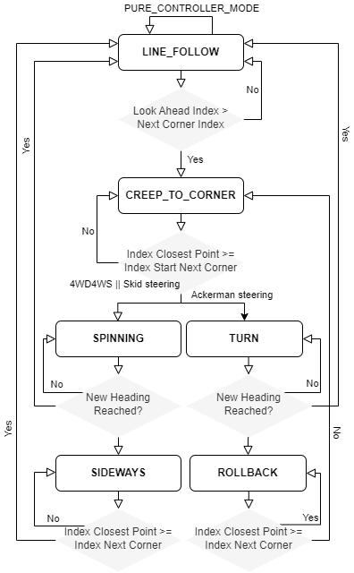
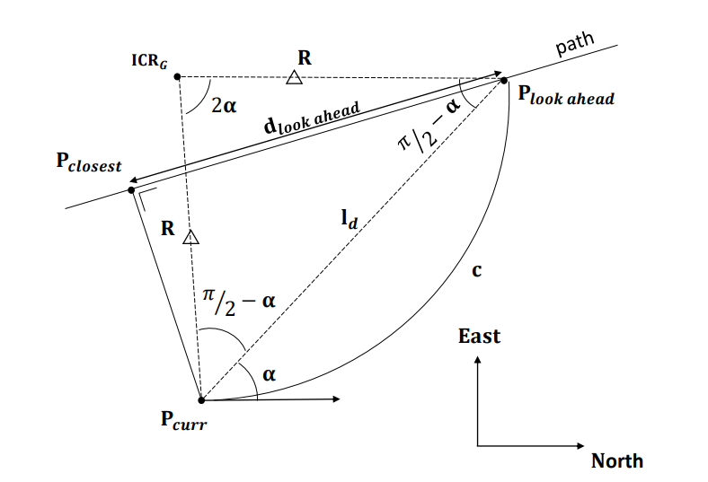
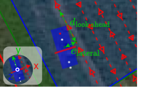

.. _operational_layer:

Operational layer
=================

Introduction
------------

All processes in the operational layer are implemented in Cplusplus (CPP).
For the implementation, we refer to `operational-layer <https://github.com/artof-ilvo>`_ project.

Requirements
------------

#. **RTK GNSS localisation (with heading)**  : The framework includes a driver for the `Septentrio Mosaic-H <https://www.septentrio.com/en/products/gnss-receivers/gnss-receiver-modules/mosaic-h>`_ module.

   + *Example components*: `SimpleRTK3B Heading <https://www.ardusimple.com/product/simplertk3b-heading/>`_

#. **Computer**: The computer runs the operational layer and the add-ons.

   + *Tested on*:

+-------------+--------------+--------------------------------------------+----------+
| Brand       | Model        | CPU                                        | Memory   |
+=============+==============+============================================+==========+
| Asus        | Gigabyte     | Intel(R) Core(TM) i5-10210U CPU @ 1.60GHz  | 60 GB    |
+-------------+--------------+--------------------------------------------+----------+
| Intel       | NUC          | Intel(R) Core(TM) i7-                      |          |
+-------------+--------------+--------------------------------------------+----------+
| Intel       | NUC          | ...                                        |          |
+-------------+--------------+--------------------------------------------+----------+

#. **Operating system**:

   + The operational layer is currently only compiled for *Ubuntu 22.04*.

   + The operational layer can run in a Docker container, which is useful for testing and development. However, this is not recommended for operation as it has not yet been validated on inference.

.. _operational_layer_processes:

Processes
---------

VariableManager
^^^^^^^^^^^^^^^

All processes in the *operational layer* inherit the :cpp:class:`VariableManager`.

During initialization, it loads a :cpp:member:`VariableMap::variableMap` of type ``std::map<std::string, VariablePtr> VariableMap``

The pseudocode below illustrates what it does.

.. code-block:: cpp
   :caption: Pseudocode :cpp:class:`VariableManager` main loop

      while (true) {
         // start a clk cycle (f = 20 Hz => T = 50 ms)
         clk.start();
         // Read all Redis variables
         readRedisVariables();
         // Execute process specific code
         serverTick();
         // Write Redis variables (only those who were altered during the cycle)
         writeRedisVariables();
         // Communicate process health
         toggleHeartBeatPulse();
         publishProcessingTime(clk.poll());
         // Stop the clk cycle (sleep for the remaining time)
         clk.stop();
      }

#. The :cpp:member:`Clk::clk` member of the :cpp:class:`VariableManager` class supports process execution at a fixed frequency, which is by default configured to ``20 Hz``. When the main loop executes more quickly, the additional time waits at the :cpp:func:`void Clk::stop()` method; otherwise, the process is immediately continued.

#. The :cpp:func:`void readRedisVariables()` and :cpp:func:`void writeRedisVariables()` methods perform block read and write the Redis variables described in the redis configuration file at once. For the :cpp:func:`void writeRedisVariables()` only the

#. The :cpp:func:`void serverTick()` is a pure abstract function implemented in the child class.

#. The :cpp:func:`void toggleHeartBeatPulse()` toggles a heartbeat boolean at a period ``500ms``. The :cpp:class:`SystemManager` uses the heartbeat to monitor the health of the different real-time processes. The :cpp:class:`SystemManager` recovers the process when it detects no heartbeat for ``5s``. The PLC in the *mechatronic layer* also monitors the heartbeat of the :cpp:class:`Navigation` process. The robot goes to error mode if it detects no heartbeat within ``2s``.

#. :cpp:func:`void publishProcessingTime()` publishes the processing time to monitor if the process maintains its target frequency.

.. _system_manager:

SystemManager
^^^^^^^^^^^^^

The :cpp:class:`SystemManager` process manages the other :cpp:class:`Jobs`, which are the processes in the operational layer and the add-ons.
The :cpp:class:`Jobs` can be started, interrupted, reconfigured, and updated.
The system manager monitors the health of the *operational layer* processes by their heartbeats.

Navigation
^^^^^^^^^^

The :cpp:class:`Navigation` process implements the navigation Finite State Machine (FSM) in *Figure 1*.
This FSM supports navigation modes that depend on the vehicle configuration and are described in the :ref:`platform configuration <basic_concepts_platform>`.

   **Figure 1.** The Finite State Machine (FSM) for navigation control

In the ``LINE_FOLLOW`` state, the :cpp:class:`Navigation` uses the pure pursuit algorithm as the most basic controller, but the framework also enables the implementation of other controllers.
The available controllers are elaborated in :ref:`Navigation algorithms <operational_layer_navigation_algorithms>`.

The FSM execution depends on the selected ``navigation mode`` in :ref:`system add-on web app (App:Settings) <addon_system>`.

Operation
^^^^^^^^^

The :cpp:class:`Operation` process operates the implement, hitch, and sections during autonomous field operation using information from the implement configuration and current robot platform state.
The implement configuration files described the dimensions and transformation of the different sections relative to hitch pens and their allowed task types, enabling the continuous position and geometry calculation of the implement sections in GNSS coordinates.

Gps
^^^

The :cpp:class:`Gps` process is the device driver for the GNSS `Septentrio Mosaic-H <https://www.septentrio.com/en/products/gnss-receivers/gnss-receiver-modules/mosaic-h>`_ module, but also drivers for other GNSS devices can be implemented in the :cpp:class:`Gps` class
It continuously updates the robot state and the other GNSS-dependent variables and maintains the connection to the NTRIP server to receive RTK connections.

RobotPlc
^^^^^^^^

The :cpp:class:`RobotPlc` process is the interface between the Redis variables in the *operational layer* and the robot PLC in the *mechatronic layer*.
The ``redis.json`` configuration file describes the interface, where the Redis variables that must be read and written to the PLC are listed. Communication was performed every process cycle by a read and write snap7 operation (Siemens\textsuperscript{\textregistered} S7-communication protocol).
For more information on the configuration, we refer to the :ref:`basic_concepts`.

Simulation
^^^^^^^^^^

The :cpp:class:`Simulation` process enables software integration- and hardware-in-the-loop (HWIL) testing.
By setting the robot in ``simulation mode``, the robot's navigation and implement operations are performed in a virtual environment by simulating the :cpp:class:`Gps` process from the *operational layer* and the kinematic models from the *mechatronic layer*.
HWIL testing performs static implement operation and steering while the traction drives remain inhibited.

.. _operational_layer_navigation_algorithms:

Navigation algorithms
---------------------

Pure pursuit heading control
^^^^^^^^^^^^^^^^^^^^^^^^^^^^

*Figure 2* was used to derive the pure pursuit control algorithm.

   **Figure 2.** The pure pursuit algorithm

The sine rule in triangle :math:`ICR_G`, :math:`P_{curr}`, :math:`P_{look\,\,ahead}` was applied to find:

.. math::
    &\hspace{20pt}\frac{l_\mathrm{d}}{\sin(2\alpha)} = \frac{R}{\sin(\frac{\pi}{2} - \alpha)}  \\
    &\Leftrightarrow \frac{l_\mathrm{d}}{2\,\sin(\alpha)\,\cos(\alpha)} = \frac{R}{cos(\alpha)}  \\
    &\Leftrightarrow \frac{l_\mathrm{d}}{\sin(\alpha)} = 2\,R  \\
    &\Leftrightarrow c = \frac{1}{R} = \frac{2\,\sin(\alpha)}{l_\mathrm{d}}

Pure pursuit heading and PI lateral control (4WD4WS only)
^^^^^^^^^^^^^^^^^^^^^^^^^^^^^^^^^^^^^^^^^^^^^^^^^^^^^^^^^

For 4WD4WS vehicle configuration robots, an additional lateral Proportional-Integral-Derivative (PID) controller was added, as illustrated in *Figure 3*. This lateral (crab steering) controller operated simultaneously with the pure pursuit heading controller. A latch determines if the robot system reached a steady state. If the robot entered the zone 0.2 m from the line, ``steady-state mode`` was activated. If it deviated more than 0.5 from the line, the robot was in ``rough mode``. When the robot system was in ``steady-state mode``, the PI controller eliminated steady-state errors. A P controller was used if the robot was in ``rough mode``.

   **Figure 3.** 4WD4WS navigation pure pursuit heading and PI lateral controller